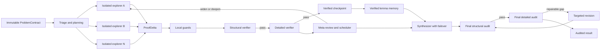

# MathProofMesh

MathProofMesh 是一个面向高难度数学证明、逻辑推演和研究型推理任务的多智能体系统。它强调三件事：**隔离探索、验证优先、过程可恢复**。

当前源码版本为 **0.5.1**。本地目录仍名为 `MathProofMesh-0.5.0`，这只是旧目录名，不影响安装、运行或提交；实际版本以 `pyproject.toml`、`BUILD_INFO.json` 和 `mathproofmesh.__version__` 为准。

> `verified` 表示配置的独立审计链已经通过，不等同于 Lean、Coq 或 Isabelle 的内核证明。MathProofMesh 会尽力阻止未经验证的推理进入最终答案，但自然语言模型仍可能共同犯错；高风险结论应继续由领域专家或形式化证明助手复核。

## 核心能力

- **一 key 一 Agent**：每个规划、探索、审查和综合角色读取独立环境变量，拥有独立并发、重试、限流和使用量记录。
- **稀疏通信**：初始 Explorer 相互隔离；跨路线信息只通过结构化 Claim、验证报告和 Meta-Reviewer 传递。
- **两级验证**：先检查题意、依赖、定理适用条件和证明结构，再进行逐步数学审计与反例搜索。
- **已验证检查点**：长证明被拆成 `ProofDelta`；只有通过本地守卫和独立 Reviewer 的增量才会提交为 `ProofCheckpoint`。
- **断线与跨 key 接力**：同一 key 重试耗尽后，可把最近的已验证检查点交给备用 Agent；进程重启后可用 `resume` 继续。
- **失败感知调度**：系统根据验证结果、失败层级、停滞程度和剩余预算决定拓宽路线、定向修补、复核或进入综合。
- **独立终审与自动修订**：最终草稿必须通过结构审计和详细审计；可修复缺口会进入定向修订，修订稿必须重新接受完整独立审计。
- **可追溯运行产物**：保存结构化结果、调用记录、检查点、工具证据、通信图和 Activity 时间线，不传播模型私有思考链。

## 快速开始

### 1. 安装或复用环境

Windows PowerShell：

```powershell
cd C:\Users\yanxinyu\Desktop\MathProofMesh-0.3.1-DeepSeek-SSE\MathProofMesh-0.5.0

# 第一次运行时创建；已经存在 .venv 就不要重复创建
python -m venv .venv
Set-ExecutionPolicy -Scope Process Bypass
.\.venv\Scripts\Activate.ps1
python -m pip install -e ".[dev,server]"
```

Linux 或 macOS：

```bash
python -m venv .venv
source .venv/bin/activate
python -m pip install -e ".[dev,server]"
```

Python 要求为 **3.11 及以上**。

不使用外部 API 的确定性演示：

```powershell
mathproofmesh demo --run-root demo-runs
mathproofmesh demo --continuation --run-root demo-runs
```

`demo` 使用 Mock Agent，不需要 API key，也不会产生模型费用。

### 2. 配置 DeepSeek API key

DeepSeek 两个预置配置都会读取以下五个环境变量。系统不会把真实 key 写入 YAML、日志或 Git 提交。

```powershell
$env:DEEPSEEK_AGENT_1_KEY="..."
$env:DEEPSEEK_AGENT_2_KEY="..."
$env:DEEPSEEK_AGENT_3_KEY="..."
$env:DEEPSEEK_AGENT_4_KEY="..."
$env:DEEPSEEK_AGENT_5_KEY="..."
```

上面的 `$env:` 只对当前 PowerShell 窗口有效。需要跨终端保存时，可以写入当前 Windows 用户的环境变量；共享电脑更适合使用专用 secret manager。

```powershell
[Environment]::SetEnvironmentVariable("DEEPSEEK_AGENT_1_KEY", "...", "User")
```

为其余四个变量执行同样操作，然后重新打开 PowerShell。仓库中的 `.env.example` 只用于说明变量名，当前 CLI **不会自动加载 `.env`**；`.env` 已被 `.gitignore` 排除。

先检查凭据和模型可见性。普通 probe 不发送付费补全，也不会打印 key：

```powershell
mathproofmesh probe --config config.deepseek-v4-pro.yaml
```

需要同时验证真实补全时：

```powershell
mathproofmesh probe --config config.deepseek-v4-pro.yaml --completion
```

`--completion` 会让每个 Agent 发出一次小型请求，因此会产生少量费用。

### 3. 运行冒烟版或正式版

把题目保存为 UTF-8 文本，例如 `examples/problem.txt`。

冒烟版：

```powershell
mathproofmesh solve examples/problem.txt `
  --config config.deepseek-v4-pro.smoke.yaml `
  --run-id smoke-prime-001
```

正式版：

```powershell
mathproofmesh solve examples/problem.txt `
  --config config.deepseek-v4-pro.yaml `
  --run-id imo-hard-001
```

恢复中断运行：

```powershell
mathproofmesh resume imo-hard-001 --config config.deepseek-v4-pro.yaml
```

输出完整 JSON：

```powershell
mathproofmesh solve examples/problem.txt --config config.deepseek-v4-pro.yaml --json
```

控制终端 Activity 时间线：

```powershell
mathproofmesh solve examples/problem.txt --config config.deepseek-v4-pro.yaml --activity compact
mathproofmesh solve examples/problem.txt --config config.deepseek-v4-pro.yaml --activity detailed
mathproofmesh solve examples/problem.txt --config config.deepseek-v4-pro.yaml --activity off
```

Activity 只展示阶段、Agent 任务和结构化结果摘要，不显示原始 `reasoning_content`。

### 4. 拉取或切换分支后继续使用

最省事的方式是只保留一个 Git 仓库，在同一目录切换分支。这样 `.venv` 和用户级 API 环境变量都能复用：

```powershell
git fetch origin
git switch <branch-name>
git pull --ff-only
.\.venv\Scripts\Activate.ps1
```

源码采用 editable install，普通源码更新不需要重新安装。只有 `pyproject.toml` 中的依赖、入口点或构建配置发生变化时，再执行：

```powershell
python -m pip install -e ".[dev,server]"
```

## DeepSeek 配置档位

| 配置 | 冒烟版 | 正式版 |
| --- | ---: | ---: |
| 文件 | `config.deepseek-v4-pro.smoke.yaml` | `config.deepseek-v4-pro.yaml` |
| Agent 数 | 5 | 5 |
| 单个 Agent 请求输出上限 | 50,000 tokens | 100,000 tokens |
| 单个证明分段输出上限 | 50,000 tokens | 100,000 tokens |
| 每段最多新增结构化步骤 | 8 | 12 |
| 每条路线最多分段数 | 4 | 12 |
| 初始路线 / 最大路线 | 2 / 3 | 3 / 6 |
| 最大调度轮数 | 2 | 4 |
| 整个 run 最大调用数 | 28 | 42 |
| 最终修订上限 | 1 | 3 |
| 整个 run token 预算 | 300,000 | 2,000,000 |
| 配置费用上限 | USD 0.75 | USD 5.00 |

这些值是 MathProofMesh 向提供商发出的请求和本地预算上限；模型或 API 服务自身如果有更低硬限制，仍以提供商返回为准。

### “最多 12 步”是什么意思

正式版的 `continuation.max_new_steps_per_call: 12` 表示：**一次分段续推最多提交 12 个新的、结构化的证明步骤**。它不是整道题只能有 12 步，也不是系统最多调用模型 12 次。

每个分段形成一个 `ProofDelta`。其中的步骤可以依赖：

- 已提交检查点中的步骤；
- 已验证 Claim；
- 明确写出准确形式和适用条件的外部定理；
- 当前同一 Delta 中排在它前面的步骤。

Delta 通过独立验证后才推进检查点。正式版每条路线最多 12 个分段，因此长证明可以分批继续；调度器仍受总调用数、总 token、费用和路线预算约束。冒烟版对应每段最多 8 步、每条路线最多 4 个分段。

## 系统流程



初始探索彼此隔离。Reviewer 不直接互相对话；Meta-Reviewer 负责聚合分歧和定位首个错误。原始模型回答作为证据保存，但不会默认广播给其他 Agent。

## 0.5.1 新增与修复

### 调度器正确性

- 路线覆盖率改为 `current_paths / max_paths`，不会在尚有扩展容量时误判“已经覆盖全部路线”。
- 结构审查和聚合审查都进入路线状态，结构失败不再丢失为 `None`。
- 单纯增加证明步数不再被视为可靠进展；结构失败、高置信度 FAIL、计划失败和策略失败会折扣或限制进展分数。
- 执行级、计划级、策略级和未知失败使用不同修补上限，重复失败路线进入冷却。
- 当所有已探索路线都失败、仍有路线容量且预算允许时，调度器强制保留一次 `widen`，避免反复深挖同一错误机制。
- 动作成本按实际新增路线、分段续推、Delta 审查、Claim 提取、候选复核和 Meta-review 动态估算。
- 最终预算会预留“综合 + 终审”和配置数量的“修订 + 完整复审”周期。
- `budget_decision_round_*.json` 记录候选动作的得分、排序、预计成本、未选原因和预算阻断原因。

### 断点续推与故障切换

- 同一 Delta 内允许后续步骤依赖前面刚产生的步骤，同时继续拒绝前向依赖、缺失依赖和自依赖。
- 只有通过本地完整性守卫和独立 Reviewer 的 Delta 才提交为不可变检查点。
- 网络错误先在原 key 上按策略重试；401/403 跳过无意义的同 key 重试，再尝试备用 key。
- 备用 Agent 接收原题、策略、最近已验证检查点和当前子目标，不接收半截 SSE 或私有思考链。
- 不只探索和审查阶段支持接力；主 Synthesizer 连接失败时也会尝试合格的备用 Agent。
- 最终结构审计会排除实际完成综合的 Agent，确保故障切换后仍保持作者与审稿人隔离。

### 终审策略调整

0.5.1 调整的是**形式要求**，不是数学正确性门槛：

| 情况 | 系统处理 | 能否直接得到 `verified` |
| --- | --- | --- |
| 标准公认定理没有书目链接，但准确形式和全部假设已明确验证 | 不再仅因缺少书目定位判 FAIL，可作为说明或警告 | 可以继续审计 |
| 定理名称存在，但调用的准确形式没有写出 | 阻断通过并要求修订 | 不可以 |
| 定理的某个适用条件没有显式推出 | 视为可修复执行缺口，进入定向修订 | 修订并重新审计前不可以 |
| 依赖缺失、循环依赖、题意被改变 | 结构门直接阻断 | 不可以 |
| SymPy 或数值工具找到反例 | 即使模型自报 PASS，也强制改为 FAIL | 不可以 |
| 只是措辞、书目格式或非数学性的展示问题 | 可记录为 warning | warning 本身不能替代数学证据 |

最终审计未通过时，系统只对执行级或计划级缺口进行有限次定向修订。每次修订后都会重新运行独立结构审计和详细审计；不会沿用上一轮 PASS，也不会因为“已经修过一次”自动放行。策略级矛盾不会靠润色同一证明掩盖，而是保持 `unverified`。

一句话概括：**可以不重证费马小定理，也可以不提供书目页码，但必须准确说明使用了什么形式，并逐项验证它的适用条件。**

## 运行状态

- `verified`：最终结构审计和详细审计通过，聚合置信度达到配置阈值。
- `unverified`：得到答案或部分证明，但独立审计尚未达到通过条件。
- `budget_exhausted`：本次运行预算耗尽；中间结果、检查点和报告仍会保留。
- `failed`：发生未恢复的基础设施异常。

界面中的 `AgentCallFailure` 表示某个模型调用失败，不表示数学命题已经被反驳。系统会按配置尝试重试或备用 Agent；若仍无法完成独立审计，结果保持 `unverified` 或 `failed`，不会伪装成 `verified`。

## 关键配置

### 失败感知调度

```yaml
scheduler:
  max_actions_per_round: 2
  widen_paths_per_action: 2
  force_widen_when_all_failed: true
  max_execution_repairs_per_path: 1
  max_plan_repairs_per_path: 1
  max_unknown_failure_repairs_per_path: 1
  allow_strategy_failure_repair: false
  failed_path_cooldown_rounds: 1
  reserve_revision_cycles: 1
  include_post_action_verification_in_cost: true
  include_meta_review_in_cost: true
  diagnostics_enabled: true
```

### 稀疏通信

```yaml
topology:
  neighbor_k: 2
  isolate_initial_exploration: true
  conditional_cross_review: true
  disagreement_threshold: 0.30
  max_context_chars: 180000
  max_verified_claims_per_context: 30
```

`neighbor_k` 限制一条路线最多读取多少个其他来源的已验证 Claim。它是按当前策略和反馈动态检索的语义近邻，不是固定的聊天群组。

### 验证

```yaml
verification:
  structural_first: true
  detailed_only_after_structural_pass: true
  verify_problem_integrity: true
  require_first_error_step: true
  require_key_step_tagging: true
  enable_sympy_tools: true
  enable_numeric_counterexamples: true
  enable_lean: false
```

Lean 可能执行元程序，只应在可信、隔离的容器中启用。默认工具不允许任意 Python 执行。

## 运行产物

```text
runs/<run_id>/
├── events.jsonl
├── activity.jsonl
├── prompts/
├── raw/
├── structured/
├── tools/
├── deltas/
├── checkpoints/
│   ├── *_latest.json
│   ├── runtime_ledger.json
│   └── proof/<path_id>/
│       ├── 0000_*.json
│       ├── 0001_*.json
│       └── latest.json
└── reports/
    ├── run_report.md
    ├── activity_timeline.json
    ├── activity_timeline.md
    ├── communication_graph.json
    └── communication_graph.mmd
```

`raw/` 中保存的是经过适配器脱敏处理的供应商响应证据；DeepSeek 私有 `reasoning_content` 不会持久化。`latest.json` 只指向已经提交的验证检查点，截断输出和被拒绝 Delta 不会成为恢复起点。

## HTTP 服务

```powershell
$env:MATHPROOFMESH_SERVER_TOKEN="replace-with-a-long-random-token"
mathproofmesh serve --config config.deepseek-v4-pro.yaml --host 127.0.0.1 --port 8000
```

普通求解：

```bash
curl -X POST http://127.0.0.1:8000/solve \
  -H "Content-Type: application/json" \
  -H "Authorization: Bearer $MATHPROOFMESH_SERVER_TOKEN" \
  -d '{"problem":"Prove ...", "run_id":"problem-001"}'
```

Activity SSE：

```bash
curl -N -X POST http://127.0.0.1:8000/solve/stream \
  -H "Content-Type: application/json" \
  -H "Authorization: Bearer $MATHPROOFMESH_SERVER_TOKEN" \
  -d '{"problem":"Prove ...", "run_id":"problem-001"}'
```

还提供 `/resume` 和 `/resume/stream`。公开部署必须配置 token，并在反向代理层增加 TLS、请求大小限制、速率限制和访问控制。

## 验证与测试

```powershell
python -m pytest -q
python -m ruff check .
python -m ruff format --check .
python -m compileall -q src
```

当前源码基线：**60 passed, 1 skipped**；Ruff、格式检查和 `compileall` 均通过。新增回归测试包括：

- 全部旧路线失败时强制拓宽；
- 动态动作成本和最终修订预算储备；
- 冒烟版 50k 与正式版 100k 输出配置；
- 同 Delta 内的有序依赖与越界步骤拒绝；
- Synthesizer 网络失败后的跨 key 接力；
- 缺失定理适用条件触发修订，并在修订后重新执行完整独立终审；
- 标准定理不因缺少书目定位被误判，同时继续要求准确形式和全部假设。

真实 DeepSeek 调用不属于自动化测试，运行前请先执行 `mathproofmesh probe`。

## 文档

- [系统架构、通信拓扑与预算公式](docs/ARCHITECTURE.md)
- [DeepSeek V4 Pro 五 Agent 配置](docs/DEEPSEEK_V4_PRO.md)
- [证明检查点、断线接力与进程恢复](docs/CHECKPOINT_RESUME.md)
- [实时 Activity 时间线与 SSE 接入](docs/ACTIVITY_TIMELINE.md)
- [逐阶段提示词演化与消息协议](docs/PROMPT_PROTOCOL.md)
- [部署、扩展与真实 API 联调](docs/DEPLOYMENT.md)
- [可复现验证记录](docs/VALIDATION.md)
- [研究与代码实践综述](docs/RESEARCH_NOTES.md)

## 安全边界

- 不要把真实 API key 写入 YAML、源码、Issue、截图或 Git 历史。
- `.env`、`.venv`、`runs/`、构建产物和缓存均已忽略，不会进入正常提交。
- 随机测试找不到反例不构成证明；找到反例可以否定对应全称命题或暴露形式化映射错误。
- 检查点恢复的是外部化、已验证的数学状态，不是提供商服务器上的隐藏解码状态。
- 模型置信度只是调度元数据，不能把未经审计的 Claim 升级为已验证事实。
