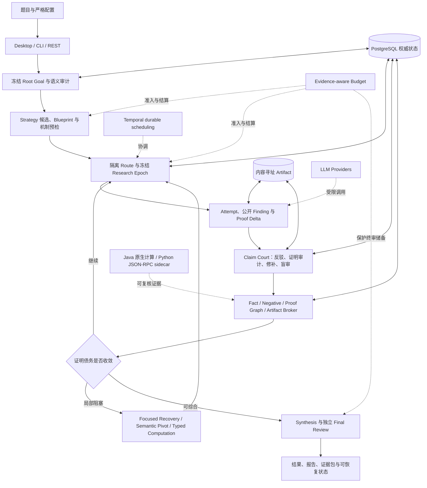
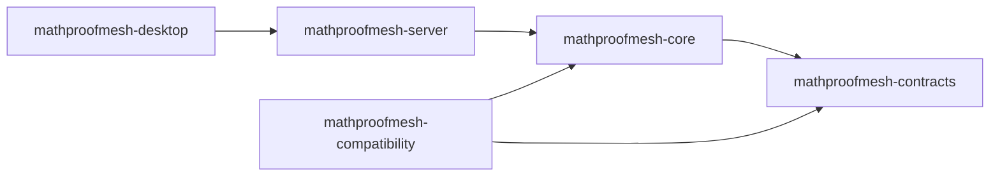

# MathProofMesh

> Java 25 驱动的、可恢复且可审计的多智能体数学证明研究系统。

MathProofMesh 面向数学竞赛题、高难度证明、逻辑推演和研究型推理任务。它不是让多个模型在同一个聊天窗口里自由讨论，而是把一次求解拆成有边界的 **Strategy、Route、Attempt、Claim、Proof Obligation、Evidence 和 Review**，再用确定性的 Java 规则、独立审查、持久化状态和资源预算约束它们如何产生、流转、晋升与恢复。

当前 Java 产品线版本为 **0.8.0**。项目已经完成从冻结 Python 基线到 Java 25 模块化单体的迁移，并通过 Issue 001-014 的修复记录持续验证真实五 Key 数学竞赛 Benchmark 中的语义、证据、并发、预算与恢复边界。

版本号需要特别区分：根 `pom.xml` 与 Java 发布包当前仍是 `0.8.0`；[Python 0.8.1](docs/legacy/python-release-notes/RELEASE_NOTES_0.8.1.md) 和 [Python 0.8.2](docs/legacy/python-release-notes/RELEASE_NOTES_0.8.2.md) 是保留的历史兼容线。Java 实现能够只读导入这些旧运行格式，但它们不是当前 Java Artifact 的版本号。

> **重要边界：** MathProofMesh 中的 `VERIFIED` 表示结果通过了当前配置的结构审查、证据门控和独立复核链；它不自动等价于 Lean、Coq 或 Isabelle 内核证明。高风险数学结论仍应由领域专家或形式化证明系统复核。

## 目录

- [项目解决什么问题](#项目解决什么问题)
- [核心设计原则](#核心设计原则)
- [一次求解的完整线路](#一次求解的完整线路)
- [Issue 001-014 能力闭环](#issue-001-014-能力闭环)
- [系统架构](#系统架构)
- [技术栈](#技术栈)
- [仓库结构](#仓库结构)
- [快速开始](#快速开始)
- [配置与 Provider](#配置与-provider)
- [数据、恢复与安全](#数据恢复与安全)
- [测试与发布门禁](#测试与发布门禁)
- [五 Key 数学竞赛 Benchmark](#五-key-数学竞赛-benchmark)
- [文档索引](#文档索引)

## 项目解决什么问题

大模型可以快速提出证明思路，但复杂数学任务中的主要风险通常不在“没有想法”，而在以下位置：

- 原题在翻译、摘要或多轮 Prompt 中发生量词、范围或结论漂移；
- 多条路线只是换了措辞，本质上共享同一个未经验证的关键假设；
- 一条 Route 整体失败后，其中已经成立的局部 Claim 也被一起丢弃；
- 模型没有找到反例，却被错误解释为命题成立；
- 错误证明被误判成错误命题，或者可局部修补的证明被整体否定；
- 跨路线消息只有“送达”记录，却没有证据证明它真的被后续证明使用；
- 长推理在输出截断、JSON 损坏、进程中断后丢失公开的中间发现；
- 多 Key 并发造成重复调用、凭据争抢、非确定性合并或部分权威写入；
- 调用次数、Token、费用与最终验证储备没有在动作执行前统一准入；
- Checkpoint、运行结果、用量账本和 UI 状态彼此矛盾，恢复时无法判断谁是真源。

MathProofMesh 的目标是把这些风险变成**有类型、可测试、可持久化、可重放的系统状态**。最终产物不只是一段答案，还包括目标哈希、策略与路线谱系、Claim 审理、Proof Graph、计算证书、Provider 用量、Checkpoint、恢复记录和最终独立审查结果。

适用场景包括：

- 数论、组合、代数、不等式、几何、函数方程等竞赛证明；
- 需要多路线搜索与反例优先排错的研究型问题；
- 需要中断恢复、成本约束和完整审计链的长时间推理；
- 需要比较不同模型、不同角色或不同策略机制的可重复实验。

它不是：

- 自由文本 Agent 群聊框架；
- 默认执行模型生成任意 Python 的代码代理；
- 以模型自信度、投票数或路线热度代替数学证据的系统；
- 默认提供形式化内核证明的 theorem prover。

## 核心设计原则

### 1. 原题目标不可漂移

输入题目首先冻结成 `RootGoalContract`，并绑定原文、`goal_hash`、量词骨架、作用域和结论形状。英文解释或语义视图只能作为非权威 sidecar，不能覆盖主目标。

### 2. 模型负责提案，服务端负责权威

模型可以提出 Strategy、Claim、反例候选、修补和 Pivot，但 ID、哈希、状态迁移、证据等级、Graph closure、Fact 晋升和永久 Negative Knowledge 都由服务端确定性代码控制。

### 3. 路线隔离，证据共享

初始 Route 相互隔离，避免共同上下文造成同源错误。跨路线只传递经过类型、作用域、来源、权威和容量检查的数学 Artifact，而不是自由聊天文本。

### 4. Claim、Attempt 与 Route 分开审理

Attempt 成功不代表其中每个 Claim 都成立；Route 失败也不代表其中每个局部 Lemma 都无效。Claim 使用独立生命周期、独立 Reviewer 和单调状态机。

### 5. 未找到反例不等于证明

`NOT_REFUTED`、有限采样、模型置信度和多路线共识都不能直接晋升为 Fact。只有精确绑定目标、作用域、证书和独立复核的证据才能获得对应权威。

### 6. 所有长流程都必须可恢复

Provider 调用、研究 Finding、Claim Court、计算、并发 Epoch、预算 Reservation 和运行状态都有稳定身份与持久化前沿。重试应返回既有结果或确定性 roll-forward，而不是重复产生副作用。

### 7. 调度不能改变数学真值

预算、并发、Proof Control、遥测和 Temporal 只决定“何时做什么”，不能直接写 Fact、关闭 Obligation 或改变冻结题目。

### 8. 账单事实与数学进度分离

一次 Provider 调用可以已经计费，但尚未形成完整语义 Checkpoint。终端用量可以在持久证据支持下单调扩展，不能反过来伪造数学进度。

## 一次求解的完整线路



实际执行可以概括为以下 14 步：

1. **加载与预检**：严格解析 YAML、题目文件、Agent、Provider、并发和预算配置；未知字段或不安全路径直接失败。
2. **冻结目标**：保存原题精确文本和稳定哈希，审计范围、量词次序、统一见证量、极性和结论形状。
3. **语义 Triage**：生成非权威语义视图，识别题目领域、潜在歧义和验证风险，但不改写 Root Goal。
4. **Strategy 生成**：候选先编译成多节点 Blueprint，再计算服务端拥有的机制签名、关键 Claim 上下文和可执行预检。
5. **全局组合选择**：按机制差异、关键 Claim 风险、互补性、成本和共同失效模式选择 Portfolio，而不是按标题或模型评分选路线。
6. **Route 隔离探索**：每条路线拥有自己的团队、Attempt、局部上下文和义务；多 Key 工作在同一个冻结 Authority Snapshot 上并发执行。
7. **研究 Checkpoint**：长调用中的公开 Finding 以有界 marker、原文切片、offset 和 SHA-256 落入 Ledger；私有思维链不进入数学权威。
8. **Artifact 收割**：从 Attempt 中区分 local lemma、route theorem、counterexample 和 proof step，不使用 Route 总体 verdict 批量决定 Claim 真值。
9. **Claim Court**：冻结 Claim 语义，依次执行 statement falsification、proof audit、有限局部 repair 和独立 blind adjudication。
10. **权威投影**：验证通过的 Claim 才能进入 Fact；可信反例进入永久 Negative Knowledge；Proof Graph 关闭或重新打开精确 Obligation。
11. **跨路线复用**：Broker 发布类型化数学 Artifact，记录明确 use manifest、receipt、lineage 和可验证下游效用。
12. **收敛控制**：Proof Graph 识别重复义务、共享瓶颈和无进展轮次，触发 focused recovery、representation switch 或真正的 semantic pivot。
13. **预算调度**：每个完整动作在进入 ready queue 前预留 calls、input/output tokens、费用和最终综合/审查储备；无认证增益不会无限获得深化预算。
14. **综合与恢复**：通过 readiness gate 后生成最终证明并盲审；运行状态分别对账执行、数学、用量、Campaign 和报告，再输出可恢复证据包。

## Issue 001-014 能力闭环

仓库中的 14 份 `fix-*` 文档不是零散补丁，而是从“题目不漂移”一路补齐到“真实调用可恢复、可计费、可复核”的完整能力链。

| Issue | 能力 | 解决的核心问题 | 详细记录 |
| --- | --- | --- | --- |
| 001 | Exact Goal Contract | 冻结原题，阻止量词、作用域、统一见证和结论类型在 Triage/翻译中漂移 | [fix-001](docs/fix-001-exact-goal-contract.md) |
| 002 | Permanent Negative Knowledge | 区分临时拒绝、可信反例与确定性 Guardrail，并在所有生产入口和恢复路径统一阻断已知错误 | [fix-002](docs/fix-002-permanent-negative-knowledge.md) |
| 003 | Claim / Attempt / Route Separation | Route 或 Attempt 的整体成败不再批量决定 Claim；失败路线中的正确局部结论仍可独立保存 | [fix-003](docs/fix-003-claim-attempt-separation.md) |
| 004 | Durable Research Checkpoints | 输出截断、JSON 丢失或预算耗尽时，保留经过精确 trace 绑定的公开中间 Finding | [fix-004](docs/fix-004-durable-research-checkpoints.md) |
| 005 | Proof Graph Convergence | Canonicalize 重复 Obligation，区分 raw occurrence、canonical target 与 bottleneck family，并触发有界 focused recovery | [fix-005](docs/fix-005-proof-graph-convergence.md) |
| 006 | Semantic Pivot | 把局部修补与真正改变数学对象/表示/方向的 Pivot 分开；Pivot 必须有类型化结构差异和独立审查 | [fix-006](docs/fix-006-semantic-pivot.md) |
| 007 | Strategy Mechanism Diversity | 用服务端机制图而不是标题判断策略多样性；对关键 Claim 和注册计算做 admission preflight | [fix-007](docs/fix-007-strategy-mechanism-diversity.md) |
| 008 | Claim Proof Repair Court | 分离“命题为假”和“当前证明无效”，支持有限局部修补、角色隔离与盲审 | [fix-008](docs/fix-008-claim-proof-repair-court.md) |
| 009 | Mathematical Artifact Broker | 跨路线传递可验证数学对象，区分送达、明确使用和真实下游效用，并保存完整归因谱系 | [fix-009](docs/fix-009-mathematical-artifact-broker.md) |
| 010 | Reproducible Computation Evidence | 统一类型化计算能力、不可变证据包、独立 certificate verifier、exactly-once 执行和 Java 原生精确实验 | [fix-010](docs/fix-010-reproducible-computation-evidence.md) |
| 011 | Run State Reconciliation | 分离 execution、math、usage、campaign、report 五种状态，解决 Checkpoint、结果、UI 与账本 split-brain | [fix-011](docs/fix-011-run-state-reconciliation.md) |
| 012 | Sustained Multi-Key Concurrency | 通过虚拟线程、凭据 Lease、冻结 Epoch、全完成 barrier 和稳定单写者合并实现持续多 Key 并发 | [fix-012](docs/fix-012-sustained-multi-key-concurrency.md) |
| 013 | Evidence-aware Budget | 在动作执行前统一准入 calls、tokens、cost 和 finish reserve；只认 hash-bound certified gain，持久化停止策略 | [fix-013](docs/fix-013-evidence-aware-budget-token-stop-policy.md) |
| 014 | Structured Output Recovery & Accounting | 修复结构化输出恢复和终端用量对账，并把真实五 Key 冷启动中发现的恢复、权威、并发和预算边界逐项闭环 | [fix-014](docs/fix-014-structured-output-recovery-accounting.md) |

这些能力共同维护几条不可绕过的不变量：

| 容易混淆的事件 | MathProofMesh 的判定 |
| --- | --- |
| 模型说“已证明” | 只是候选输出，不是数学权威 |
| Attempt PASS | 不自动验证其中全部 Claim |
| Route FAIL | 不自动否定其中已独立验证的 local Claim |
| 有限搜索没有反例 | `NOT_REFUTED`，不是 `VERIFIED` |
| 消息已送达或已确认 | 不等于证明实际使用了它 |
| 多条路线同意 | 不等于独立证据，可能是共同失效模式 |
| Temporal Activity 完成 | 不等于 PostgreSQL 数学状态已经提交 |
| Provider 已计费 | 不等于语义 Checkpoint 已推进 |

## 系统架构

### 模块依赖

MathProofMesh 采用**模块化单体**，保留严格所有权边界，同时避免在首个 Java 版本中引入微服务和分布式事务成本。



| 模块 | 职责 | 关键边界 |
| --- | --- | --- |
| `mathproofmesh-contracts` | 严格 Java records、enum、JSON schema、canonical JSON、稳定 hash 和输入校验 | 不依赖 Spring，不承载业务编排 |
| `mathproofmesh-core` | Proof Control、Memory、Proof Graph、Claim Court、Broker、Computation、Concurrency、Run State 与 Verification 领域规则 | 尽量 framework-free，不直接访问网络、数据库或 UI |
| `mathproofmesh-server` | Spring 配置、REST/SSE/CLI、Provider adapters、PostgreSQL/Flyway、Artifact、Python sidecar adapter 与 Temporal workflows | I/O 通过适配器进入 Core，使用显式 JDBC 而非 JPA/Hibernate |
| `mathproofmesh-desktop` | JavaFX/WebView 桌面端、Loopback API、DPAPI 凭据、Desktop Coordinator、打包与 Benchmark production harness | UI 不直接访问数据库或 Provider key |
| `mathproofmesh-compatibility` | Python 旧运行只读导入、版本迁移、shadow comparator 与差分测试 | 旧 Python 是迁移证据，不是生产依赖 |

依赖方向由 Maven Enforcer、Spring Modulith 和 ArchUnit 检查。反向依赖、重复类和越权访问会在构建阶段失败。

### 运行时分层

```text
Interface
  Desktop JavaFX/WebView | CLI/Picocli | REST + resumable SSE
        |
Application / Orchestration
  DesktopRunManager | DesktopSolveCoordinator | RunApiService
  StructuredAgentRunner | AgentPool | Temporal Workflows
        |
Domain
  Goal/Strategy/Route/Attempt/Claim | Memory | Proof Graph
  Claim Court | Artifact Broker | Computation | Budget | Run State
        |
Infrastructure
  PostgreSQL + Flyway | Content-addressed Artifact Store
  JDK HttpClient Provider Adapters | Python stdio Sidecar | Observability
```

### 权威归属

| 数据或行为 | 真源 |
| --- | --- |
| Run、Claim、Fact、Negative、Obligation、Checkpoint、Provider call、Lease、Budget、Outbox/Inbox | PostgreSQL 事务状态 |
| 文件模式下的 Desktop Run State | 原子写入、带版本与 journal 的 `structured/run_state.json` |
| 大型 Prompt/Response、计算证书和报告附件 | 不可变、内容寻址 Artifact Store |
| 工作流重试、Signal、Update、Continue-As-New | Temporal；只负责 durable scheduling，不拥有数学真值 |
| JGraphT、内存 Memory、API cache、Desktop view | 可重建 Projection |
| 模型返回的 Strategy、Claim、审稿意见 | 非权威输入，必须经过服务端 Gate |
| Python SymPy/Z3 结果 | 受限计算证据，权威上限由 Java capability policy 决定 |

项目刻意不在首个 Java 版本引入 Kafka、Redis、RabbitMQ 或 Neo4j。事务消息使用 PostgreSQL Outbox/Inbox，图算法使用 JGraphT projection，缓存保持有界且可重建。

## 技术栈

下列版本来自当前 `pom.xml`、Maven Wrapper、CI 和锁文件。

| 层 | 技术 | 用途 |
| --- | --- | --- |
| 语言与并发 | Java 25、records、virtual threads、`BigInteger`/精确有理数 | 领域模型、并发研究任务、确定性精确计算 |
| 构建 | Maven 3.9.16、Maven Wrapper 3.3.4 | 五模块 reactor、可锁定和可离线验证的构建 |
| 应用框架 | Spring Boot 4.1.0、Spring Modulith 2.1.0 | Server、配置、REST、Actuator 与模块边界 |
| 持久化 | PostgreSQL 18.4、Spring JDBC/JdbcClient、Flyway | 权威状态、CAS、Lease、Fencing、Outbox/Inbox 和 7 个版本化迁移 |
| 工作流 | Temporal Java SDK 1.37.0 | 两个 durable workflow、Activity 重试、Signal/Update、Replay 与 Continue-As-New |
| 图结构 | JGraphT 1.5.3 | Proof Graph projection、闭包、拓扑排序、瓶颈与 proof debt |
| JSON/Contract | Jackson Databind 2.21.5 | 严格反序列化、canonical JSON、SHA-256 身份和版本化快照 |
| Provider | JDK `HttpClient`、严格 JSON/SSE parser | 直接实现 DeepSeek、Anthropic、Gemini、OpenAI-compatible 和 Mock adapter |
| CLI | Picocli 4.7.7 | `solve`、`resume`、`demo`、`probe`、`serve` 命令 |
| Desktop | JavaFX 25.0.4、WebView、JNA 5.19.1、Windows DPAPI | Windows x64 桌面应用、Loopback HTTP/SSE 与本地凭据保护 |
| Python sidecar | Python 3.11+（CI 使用 3.13）、SymPy 1.14.0、Z3 4.16.0.0、mpmath 1.3.0 | 仅执行固定 allowlist 的符号化/约束计算，使用 stdio JSON-RPC 2.0 |
| 测试 | JUnit 5、AssertJ、Testcontainers 2.0.5、ArchUnit 1.4.2、Temporal Test Environment | 单元、集成、恢复、并发、架构与差分测试 |
| 质量与供应链 | JaCoCo 0.8.15、SpotBugs/FindSecBugs、OWASP Dependency-Check 12.2.2、CycloneDX 2.9.2 | 覆盖率、静态安全、漏洞扫描、许可证与 SBOM |
| 容器与 CI | Docker Compose、GitHub Actions、Ubuntu + Windows runners | PostgreSQL/Temporal 开发环境、Linux 验证和 Windows 发布包 |

Provider 层没有使用 Spring AI 或厂商 SDK。协议、流式结束条件、usage mapping、重试、`Retry-After`、模糊结果和费用对账都由项目自己的 adapter 与 fixture tests 覆盖。

## 仓库结构

```text
.
|-- mathproofmesh-contracts/       # Wire contracts、strict JSON、hash 与 schema
|-- mathproofmesh-core/            # 框架无关的数学证明领域引擎
|-- mathproofmesh-server/          # Spring、API、Provider、PostgreSQL、Temporal、Sidecar
|-- mathproofmesh-desktop/         # JavaFX 桌面端、Coordinator、Windows 与 Benchmark harness
|-- mathproofmesh-compatibility/   # Python 旧运行导入、迁移和 shadow comparison
|-- python-compute-service/        # 受限 SymPy/Z3 stdio JSON-RPC sidecar
|-- benchmark/
|   `-- olympiad-5key-v1/          # 20 题、五 Key、分层与恢复验证 harness
|-- config/                        # 通用、DeepSeek、Proof Control、Topology 配置
|-- compose/                       # Temporal 本地开发 Compose
|-- docs/
|   |-- adr/                       # Java 架构决策记录
|   |-- fix-001...fix-014          # 14 个生产问题的证据与验收记录
|   `-- legacy/                    # 冻结 Python 设计和历史 release notes
|-- examples/                      # 最小题目输入
|-- migration/
|   |-- baseline/                  # 冻结迁移基线与辅助材料
|   |-- reports/                   # Phase 00-17 验证、覆盖率、安全和性能证据
|   `-- dependency-lock.yaml       # 依赖锁定证据
|-- packaging/windows/             # Windows 打包说明
|-- scripts/                       # 验证、打包、基准、Temporal 与迁移工具
|-- .github/workflows/ci.yml       # Linux verify + Windows package + protected validate
|-- pom.xml                        # Maven reactor 与全部锁定版本
|-- PHASE_GATES.yaml               # 迁移验收门禁
`-- MIGRATION_COMPLETION_REPORT.md # Java 迁移完成报告
```

`migration/` 和 `docs/legacy/` 保留迁移权威与差分证据。生产 Java 代码不会 import 冻结 Python 应用；生产 Python 只存在于独立的受限计算 sidecar 中。

## 快速开始

### 环境要求

- JDK 25；
- Docker Engine 或 Docker Desktop + Compose v2，用于 PostgreSQL、Temporal 和 Testcontainers；
- Python 3.11 或更高版本，用于受限 sidecar 和差分验证；
- Windows PowerShell 5.1+，或 Linux/macOS POSIX shell。

不要求全局安装 Maven。仓库中的 Wrapper 会下载经过 SHA-256 固定的 Maven 3.9.16。首次在线构建准备好依赖后，可以执行完整离线门禁。

### 完整验证

Windows：

```powershell
.\scripts\verify-all.ps1
```

Linux 或 macOS：

```sh
./scripts/verify-all.sh
```

离线复验：

```powershell
.\scripts\verify-all.ps1 -Offline
```

```sh
./scripts/verify-all.sh --offline
```

### 零 Provider 演示

先生成平台中立发布包：

```powershell
.\scripts\package-release.ps1
```

再运行确定性 Mock 流程：

```powershell
target\release\JavaMathProofMesh-0.8.0\bin\mathproofmesh.cmd `
  demo --run-id readme-demo
```

该命令不需要 API Key，也不会发出真实 Provider 请求。POSIX 对应入口为：

```sh
./scripts/package-release.sh
target/release/JavaMathProofMesh-0.8.0/bin/mathproofmesh \
  demo --run-id readme-demo
```

查看 CLI：

```powershell
target\release\JavaMathProofMesh-0.8.0\bin\mathproofmesh.cmd --help
```

CLI 提供 `solve`、`resume`、`demo`、`probe` 和 `serve`。独立 Spring Server 入口为：

```powershell
target\release\JavaMathProofMesh-0.8.0\bin\mathproofmesh-server.cmd
```

### 本地基础设施

Temporal 开发服务：

```powershell
.\scripts\temporal-dev.ps1 -Command Up
.\scripts\temporal-dev.ps1 -Command Health
.\scripts\temporal-dev.ps1 -Command Down
```

手工启动 PostgreSQL 开发容器时，镜像由 digest 锁定且只绑定 loopback：

```powershell
$env:SPRING_DATASOURCE_PASSWORD = "local-development-only"
docker compose --env-file migration/image-lock.env up -d postgres
```

集成测试会自行通过 Testcontainers 启动 PostgreSQL。仓库提供的 Compose 仅用于本地开发，不是生产部署拓扑。

### Windows Desktop

```powershell
.\scripts\package-desktop.ps1
```

脚本使用 JDK 25 `jlink`/`jpackage` 构建 app image、portable ZIP 和 EXE installer，并执行打包后健康检查。产物位于：

```text
target/desktop-dist/MathProofMesh-0.8.0-windows-x64-portable.zip
target/desktop-dist/MathProofMesh-0.8.0.exe
target/desktop-dist/SHA256SUMS.txt
```

## 配置与 Provider

`.env.local.example` 只列出变量名；真实密钥只能来自环境变量或外部 secret provider，不能写入 YAML、日志、报告、SSE、Artifact 或 Git。

主要配置文件：

| 文件 | 用途 |
| --- | --- |
| `config/application.yaml` | 通用多 Provider、预算、调度、验证、计算和恢复配置 |
| `config/deepseek-v4-pro.yaml` | DeepSeek 正式配置 |
| `config/deepseek-v4-pro-smoke.yaml` | 有界冒烟配置 |
| `config/proof-control-shadow.yaml` | 只记录控制决策，不修改业务状态 |
| `config/proof-control-active.yaml` | 允许已准入控制动作委托给权威服务 |
| `config/topology-active.yaml` | Active 稀疏拓扑与灵感机制配置 |

支持的 Provider：

| Provider | 协议入口 | 特点 |
| --- | --- | --- |
| OpenAI-compatible | `/chat/completions` | Bearer auth、JSON/SSE、标准 usage 字段 |
| DeepSeek | `/chat/completions` | OpenAI-compatible wire format 与 thinking controls |
| Anthropic | `/messages` | `x-api-key`、版本头和独立 streaming lifecycle |
| Gemini | `generateContent` / `streamGenerateContent` | Gemini request/usage mapping |
| Mock | 无网络 | 确定性 demo、测试与离线验收 |

真实调用默认关闭，只有显式设置 `MPM_ALLOW_LIVE_PROVIDER_CALLS=true` 才能启用。Provider endpoint、model、并发、速率、超时、重试、Token 与费用都由 operator 配置；题目、Prompt 或 API payload 不能选择 URL、密钥、Docker image 或文件路径。

## 数据、恢复与安全

### 持久化与恢复

- PostgreSQL 通过 `V1` 到 `V7` Flyway migration 保存领域状态、消息、Memory、Proof Graph、Provider call、Run State、Research Epoch 和 Budget。
- Desktop Checkpoint 当前 schema 为 `22`，旧 schema 通过明确迁移链恢复，不重新解释旧模型输出。
- Mutable aggregate 使用 optimistic version；Lease 使用 fencing token；Outbox/Inbox 和 action key 提供幂等边界。
- Committed 数学 payload 追加写入。反例通过失效传播重新打开依赖义务，不删除历史。
- 计算 Result、Certificate、Verification Receipt 和 Outcome Receipt 都是不可变内容寻址 Artifact。
- 普通有效终态恢复不调用 Provider。只有满足精确审计条件的旧策略错误终态，才会在零调用 restore 阶段被重新开放为可执行工作。
- 语义 Checkpoint 始终代表最后完整数学前沿；终端用量扩展必须能够由不可变 Provider request Artifact 精确重建。

Run State 明确拆分为五个维度：

| 维度 | 示例 |
| --- | --- |
| Execution | queued、running、succeeded、failed、interrupted、cancelled |
| Mathematical | not started、partial unverified、candidate、verified、authority conflict |
| Usage | not recorded、partial、recorded、conflict |
| Campaign | queued、active、recoverable、terminal、archived |
| Report | absent、partial、final、stale、projection failed |

因此，“进程失败但数学进度可恢复”“调用已计费但证明未完成”“报告投影失败但权威状态完好”都能被准确表达，而不是压成一个含义不清的 `FAILED`。

### 安全边界

- Server、Desktop loopback backend、PostgreSQL 和 Temporal 开发端口默认只绑定 `127.0.0.1`；
- 除健康检查外的 API 使用 Bearer token、固定大小限制、并发限制和常量时间比较；
- Provider URL 使用 allowlist 与 SSRF 防护，redirect 重新校验；
- Jackson 拒绝 unknown fields、duplicate keys、scalar coercion 和不满足领域 invariant 的对象；
- Desktop WebView 禁止外部/file 导航、下载、开发者工具和 Provider 凭据访问；
- Windows Desktop 密钥通过 DPAPI 保存，UI 只通过随机 loopback HTTP/SSE 访问 backend；
- Python sidecar 无 TCP listener、无数据库权限、无 Provider secret，stdin/stdout、时间、进程树和输出均有界；
- 任意模型生成 Python 默认关闭；可选 sandbox 必须使用 digest-pinned image、无网络、只读文件系统、非 root 和资源上限；
- 私有 reasoning 不进入 SSE、普通日志、错误、公开 Artifact 或数学权威；只保留有界公开 Finding、摘要、长度和 hash 等允许数据。

生产部署必须另行提供 TLS/mTLS、认证、最小权限、监控、备份与恢复演练。仓库中的本地 Compose 不能直接作为生产安全模板。

## 测试与发布门禁

`scripts/verify-all.ps1` 和 `scripts/verify-all.sh` 覆盖：

- contract、unit、property、parameterized 和 authority-named regression tests；
- PostgreSQL 18.4 Testcontainers 与全部 Flyway migration；
- Temporal replay、Signal、Update、Continue-As-New 和 crash tests；
- Mock Provider、SSE fragmentation、retry、usage、rate limit 与并发；
- Python sidecar protocol、锁定依赖、differential 和性能；
- REST、resumable SSE、CLI、observability、JavaFX、DPAPI 和 package smoke；
- Legacy v0.7/v0.8.0/v0.8.1/v0.8.2 import、quarantine、resume 与 shadow comparison；
- Checkpoint hard-crash、exactly-once、并发 completion order 与 stable merge；
- JaCoCo、ArchUnit、Maven Enforcer、SpotBugs/FindSecBugs；
- OWASP Dependency-Check、CycloneDX SBOM、license、secret 和 source-immutability checks。

覆盖率硬门禁：

| 模块 | Line | Branch |
| --- | ---: | ---: |
| Contracts | >= 90% | >= 85% |
| Core | >= 85% | >= 75% |
| Server / Desktop 可测试业务代码 | >= 70% | 按报告审计 |

GitHub Actions 在 Ubuntu 执行完整 `verify` 和平台中立发布，在 Windows 构建 Server/CLI 发布包；受保护分支最终要求统一的 `validate` gate 成功。迁移完成报告和阶段证据见 [MIGRATION_COMPLETION_REPORT.md](MIGRATION_COMPLETION_REPORT.md) 与 [`migration/reports/`](migration/reports/)。

## 五 Key 数学竞赛 Benchmark

[`benchmark/olympiad-5key-v1`](benchmark/olympiad-5key-v1/README.md) 是验证专用 harness，用来观察系统在真实竞赛题、真实长推理、五个独立 Provider 凭据和中断恢复下是否仍保持 Issues 001-014 的不变量。

Benchmark 包含：

- 20 道 canonical olympiad prompts；
- `SMOKE`、`CORE`、`ADVANCED`、`STRESS` 四个资源档位；
- 20 个 standard runs、指定题目的 replication 和 controlled recovery；
- 4 个 research slots + 1 个 coordination slot，单 Key 并发上限为 1；
- 冻结题目输入、禁止答案检索、禁止跨题 Memory；
- Root Goal、Claim、Proof Graph、Negative、Computation、Checkpoint、Budget、Usage 和恢复证据导出；
- Secret leak、Root Goal drift、authority violation、重复调用、重复结算和 restore drift 硬门禁。

真实 Provider 运行默认拒绝，必须同时提供五个命名 secret、显式 opt-in、精确 Git 状态和覆盖最坏情况估算的正费用上限。普通测试只使用 Fake/Mock Provider，不会误触发真实费用。

Issue 014 正是由这个真实运行通道发现：结构化 Strategy 输出可能在 recovery 后仍不完整，而 Provider 已产生的调用又不能被错误塞进语义 Checkpoint。项目保留每次停止 Campaign 作为审计证据，再通过测试优先方式修复下一次冷启动暴露的通用系统缺陷，不修改或“美化”既有失败结果。

## 文档索引

### 架构与运行

- [Architecture](docs/architecture.md)
- [Contracts and Prompt Protocol](docs/contracts.md)
- [Proof Control](docs/proof-control.md)
- [Typed Memory](docs/memory.md)
- [Proof Obligation Graph](docs/proof-graph.md)
- [Typed Communication and Sparse Topology](docs/communication.md)
- [Computation and Evidence](docs/computation.md)
- [Provider Runtime](docs/providers.md)
- [Temporal Boundary](docs/temporal.md)
- [Observability](docs/observability.md)
- [Operations](docs/operations.md)
- [Security](docs/security.md)
- [Testing](docs/testing.md)
- [Verification Model](docs/verification.md)
- [Legacy Compatibility](docs/compatibility.md)

### 架构决策

- [Java-first hybrid](docs/adr/0001-java-first-hybrid.md)
- [Modular monolith](docs/adr/0002-modular-monolith.md)
- [PostgreSQL authoritative state](docs/adr/0003-postgresql-authoritative-state.md)
- [Temporal integration boundary](docs/adr/0004-temporal-deferred.md)
- [stdio Python sidecar](docs/adr/0005-stdio-python-sidecar.md)
- [No brokers or graph database](docs/adr/0006-no-brokers-or-graph-database.md)
- [Direct provider adapters](docs/adr/0007-direct-provider-adapters.md)
- [Legacy hash compatibility](docs/adr/0008-legacy-hash-compatibility.md)

### 迁移与历史

- [Migration Completion Report](MIGRATION_COMPLETION_REPORT.md)
- [Migration Plan](MIGRATION_PLAN.md)
- [Phase Gates](PHASE_GATES.yaml)
- [`docs/legacy/python-baseline`](docs/legacy/python-baseline/)
- [`docs/legacy/python-release-notes`](docs/legacy/python-release-notes/)

## 当前边界

- Windows Desktop 发布目标为 x64；Server 和 CLI 是平台中立 Java 25 产物。
- 本地 Temporal 是单节点开发服务；生产环境必须使用经过审查的安全部署。
- Live Provider 的可用性、模型质量和计费依赖 operator 账户；仓库不包含任何密钥。
- Python sidecar 只支持固定 allowlist；新增平台或依赖需要新的 hash-locked wheel 集与安全审计。
- 自然语言等价只允许在明确声明的非确定字段上比较；ID、hash、状态、依赖、Receipt 和 Checkpoint 必须精确一致。
- 性能基准与硬件相关；同机回归超过 20% 需要记录原因并批准新基线。

## License

[MIT License](LICENSE). 第三方组件遵循各自许可证，发布流程生成 CycloneDX SBOM 和许可证清单。
