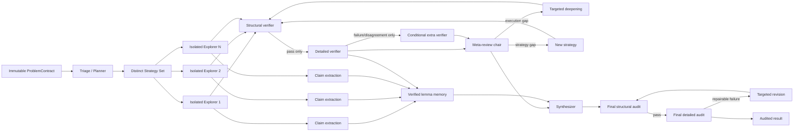

# MathProofMesh

MathProofMesh 是一个面向高难度数学证明、逻辑推演和研究型推理任务的**稀疏通信、验证优先、多 API-key 多智能体系统**。每个配置项代表一个隔离的子智能体，并读取独立的 API key；系统不会把多个 key 混成一个共享“人格”，而是显式维护角色、提供商、并发限制、调用预算、可信度记录和可追溯证据。

它不是一个“让若干模型轮流聊天”的简单工作流。核心设计是：

1. 将原题冻结为带 SHA-256 完整性哈希的 `ProblemContract`；
2. 先生成数学机制真正不同的策略，再进行相互隔离的并行探索；
3. 将长推理压缩为带来源、依赖和适用范围的 `ClaimCard`，但只允许验证通过的引理进入后续事实库；
4. 采用“结构检查 → 逐步数学检查”的两级验证门；
5. 只在失败、低置信度或审稿分歧时触发额外审稿人；
6. 由 Meta-Reviewer 汇总、去重并定位首个错误，而不是让审稿人相互争论；
7. 将长证明拆成小型 `ProofDelta`，只有通过独立验证的增量才提交为持久化 `ProofCheckpoint`；
8. 发生断连时先用原 key 重试，仍失败则把同一检查点和子目标交给备用 key，进程重启后也可由 `resume` 继续；
9. 根据进展、创新性、不确定性、停滞和剩余预算，动态决定拓宽、深挖、复核或综合；
10. 最终答案必须再经过与生成者隔离的结构审计和逐步审计。

> “verified” 仅表示配置的独立审计链通过，不等同于 Lean/Coq/Isabelle 内核证明。对于可形式化的关键结论，可以启用隔离环境中的 Lean 检查，或扩展新的形式化后端。

## 一、系统拓扑



通信是分层稀疏的：初始 Explorer 不读取其他候选答案；Reviewer 不直接互聊；跨路径知识只通过已验证引理库和 Meta-Reviewer 的聚合反馈传递。`neighbor_k` 限制单个路径最多接收多少个其他来源的引理，`max_context_chars` 对结构化上下文实行软上限，原始回答则作为不可变证据单独保存。

## 二、主要能力

- **一 key 一 Agent**：DeepSeek V4、OpenAI-compatible、Anthropic、Gemini 和 Mock 适配器；每个 Agent 有独立 semaphore、RPM 限制、重试、价格和使用量统计。
- **提示词逐阶段演化**：从不可变题目契约、策略卡、隔离探索、引理包、结构审计、详细审计、Meta-review，到最终综合和修订；每阶段输出均由 Pydantic JSON Schema 约束。
- **信息传输不丢关键语义**：假设、结论、依赖、证明步骤、适用范围、反例风险、证据引用和验证状态均为独立字段；不会用一段自由文本摘要替代全部数学结构。
- **失败感知的广度—深度自适应**：覆盖率按 `current_paths / max_paths` 计算；结构失败、策略失败和连续停滞会降低旧路线优先级。若全部已探索路线均被独立审查拒绝且仍有容量，调度器在预算允许时强制保留一次 `widen`，同时只给局部执行错误有限的定向修补机会。所有路线数、动作数、修补次数、冷却轮次和最终修订储备均由配置控制。
- **双层验证**：廉价结构门先查题意漂移、缺项、依赖图、循环、引用和关键步骤标记；通过后才进行逐步重证与反例搜索。
- **确定性工具覆盖模型判断**：安全的 SymPy 化简/等价/因式分解和有界数值反例搜索；若工具找到反例，即使模型输出 PASS，系统也强制改为 FAIL。
- **防篡改与追溯**：题目、Claim 和原始响应均有内容哈希；每次调用保存 prompt、原始响应、结构化结果、通信边、工具证据、检查点和最终报告。
- **故障降级**：单个 Agent 超时、返回非法 JSON 或失败时，不直接丢失整个运行；系统保留失败记录并在预算允许时解析修复、换审稿人或使用保守的本地回退。连续失败的 key 会进入短暂冷却，后续调度优先选择健康 Agent。
- **证明步骤级断点续推**：长证明按子目标分段；每个 `ProofDelta` 先经过本地完整性守卫和独立 Reviewer，只有 PASS 的段落才推进 `latest.json`。半截 SSE、截断 JSON 和未验证推理不会成为恢复点。
- **跨 API-key 接力**：同一 key 的网络重试耗尽后，系统把原题、策略、最近已提交检查点和当前子目标原样交给备用 Agent；401/403 不在原 key 上重复消耗请求，但允许切换其他 key；不会把原始私有思考链传给备用 key。
- **进程重启恢复**：`mathproofmesh resume <run_id>` 恢复阶段状态、证明检查点、调用预算、Agent token/费用统计和完整 Activity 时间线。
- **实时 Activity 时间线**：CLI 按时间线显示题目分析、路线分配、并行探索、验证、综合和终审进展；长调用有低频心跳。这里只显示编排状态与结构化结果摘要，不显示 DeepSeek 原始 `reasoning_content`。

## 三、快速开始

### 1. 安装

```bash
cd mathproofmesh
python -m venv .venv
source .venv/bin/activate        # Windows: .venv\Scripts\activate
pip install -e ".[dev,server]"
```

Python 要求为 3.11 及以上。

### 2. 配置独立 API key

复制示例文件：

```bash
cp config.example.yaml config.yaml
cp .env.example .env
```

系统不会自动把 `.env` 写入日志。可用 shell、容器 secret 或部署平台的 secret manager 注入环境变量：

```bash
export AGENT_PLANNER_KEY="..."
export AGENT_EXPLORER_1_KEY="..."
export AGENT_EXPLORER_2_KEY="..."
export AGENT_VERIFIER_1_KEY="..."
export AGENT_VERIFIER_2_KEY="..."
export AGENT_SYNTHESIZER_KEY="..."
```

`config.example.yaml` 中每个 `agents` 条目就是一个独立子智能体。例如：

```yaml
agents:
  - id: explorer-1
    provider: openai_compatible
    model: your-reasoning-model
    base_url: https://api.openai.com/v1
    api_key_env: AGENT_EXPLORER_1_KEY
    roles: [explorer, summarizer]
    specialties: [algebra, number_theory, combinatorics]
    max_concurrency: 1
    requests_per_minute: 20
    temperature: 0.45
    max_output_tokens: 24000
```

对于兼容 OpenAI Chat Completions 的第三方服务，只需替换 `base_url`、`model` 和对应 key。不同提供商的 JSON 模式存在差异，因此完整 JSON Schema 始终同时写入提示词，供应商侧 JSON mode 只作为额外约束。

#### DeepSeek V4 Pro：五个 key 对应五个 Agent

仓库已提供 `config.deepseek-v4-pro.yaml`。该配置固定使用：

```yaml
provider: deepseek
model: deepseek-v4-pro
base_url: https://api.deepseek.com
thinking_enabled: true
reasoning_effort: max
streaming: true
```

五个 key 只通过以下环境变量传入，不得写入 YAML、源码或提交记录：

```bash
export DEEPSEEK_AGENT_1_KEY="..."
export DEEPSEEK_AGENT_2_KEY="..."
export DEEPSEEK_AGENT_3_KEY="..."
export DEEPSEEK_AGENT_4_KEY="..."
export DEEPSEEK_AGENT_5_KEY="..."
```

Windows PowerShell：

```powershell
$env:DEEPSEEK_AGENT_1_KEY="..."
$env:DEEPSEEK_AGENT_2_KEY="..."
$env:DEEPSEEK_AGENT_3_KEY="..."
$env:DEEPSEEK_AGENT_4_KEY="..."
$env:DEEPSEEK_AGENT_5_KEY="..."
```

先验证五个凭据能否看到目标模型；该命令不打印 key：

```bash
mathproofmesh probe --config config.deepseek-v4-pro.yaml
```

增加 `--completion` 会让每个 Agent 再发送一个很小的真实补全请求，因此会产生少量费用：

```bash
mathproofmesh probe --config config.deepseek-v4-pro.yaml --completion
```

正式求解：

```bash
mathproofmesh solve examples/problem.txt \
  --config config.deepseek-v4-pro.yaml \
  --run-id hard-problem-001
```

若 Python 进程、机器或网络中断，重新注入环境变量后从最近的阶段快照和已验证证明检查点恢复：

```bash
mathproofmesh resume hard-problem-001 \
  --config config.deepseek-v4-pro.yaml
```

恢复的是外部化、经过验证的数学状态，而不是 DeepSeek 服务器端的隐藏神经网络状态。当前未完成的 SSE 调用会被丢弃；新请求从最近的 `committed` 检查点继续当前子目标。预算统计是跨进程累计的；若上次状态为 `budget_exhausted`，应在恢复配置中提高 `max_total_calls`，它表示整个 run 的总上限，而不是本次额外调用数。

首次联调可以使用调用数和输出上限更低的 `config.deepseek-v4-pro.smoke.yaml`。

DeepSeek 适配器在思考模式下不发送 `temperature`，并给每个 Agent 分配不同的 `user_id`。供应商返回的 `reasoning_content` 不会进入其他 Agent 的上下文，也不会保存到运行目录；系统只保留最终结构化内容、思考内容是否存在、字符数和哈希等非敏感元数据。

`streaming: true` 开启的是 **DeepSeek → MathProofMesh 后端** 的 SSE 增量读取。模型生成期间，适配器持续接收 `data:` 事件，并在本地拼接最终 JSON；最后一个 usage-only 事件用于记录完整 token 用量。该开关不会把尚未完成的证明片段传给其他 Agent，也不会输出原始思考链。配置字段默认仍为 `false`，因此其他已有配置的非流式行为不受影响。

这里与 HTTP 服务的 `/solve/stream` 不同：前者是模型供应商响应的流式传输，后者是 **MathProofMesh 后端 → 浏览器/终端前端** 的 Activity 时间线推送。两者可以同时启用。

### 3. 运行无外部 API 的确定性演示

```bash
mathproofmesh demo --run-root demo-runs
```

演示题为前 `n` 个奇数之和，模拟六个 Agent 完成策略生成、并行求解、引理提取、验证、Meta-review、综合和最终审计。

### 4. 求解自己的问题

把题目放入 UTF-8 文本文件：

```bash
mathproofmesh solve examples/problem.txt --config config.yaml
```

输出完整 JSON：

```bash
mathproofmesh solve examples/problem.txt --config config.yaml --json
```

默认会在终端显示类似 Activity 面板的简要时间线：

```text
Activity · 06:18
✓ 00:21  题目分析完成
✓ 00:48  证明路线已生成并分配
◐ 01:03  并行探索不同证明方向
✓ 04:11  引理归纳完成
✓ 04:35  已提交证明检查点 C3
! 05:10  原 API 重试耗尽，切换备用 Agent
◐ 05:11  从检查点 C3 继续当前子目标
◐ 05:40  验证候选证明
✓ 06:18  综合复核完成
```

可控制显示粒度：

```bash
mathproofmesh solve examples/problem.txt --config config.yaml --activity compact
mathproofmesh solve examples/problem.txt --config config.yaml --activity detailed
mathproofmesh solve examples/problem.txt --config config.yaml --activity off
```

`compact` 适合日常运行；`detailed` 还会显示结构化输出修复和长调用心跳。时间线只呈现阶段状态、Agent 当前任务和经 Schema 校验后的结果摘要，不输出模型原始私有思考链。`--json` 默认关闭终端 Activity，以保持 stdout 为纯 JSON；显式加 `--activity compact` 时，时间线写入 stderr。

### 5. HTTP 服务

```bash
export MATHPROOFMESH_SERVER_TOKEN="replace-with-a-long-random-token"
mathproofmesh serve --config config.yaml --host 127.0.0.1 --port 8000
```

请求：

```bash
curl -X POST http://127.0.0.1:8000/solve \
  -H 'Content-Type: application/json' \
  -H "Authorization: Bearer $MATHPROOFMESH_SERVER_TOKEN" \
  -d '{"problem":"Prove ...", "run_id":"problem-001"}'
```

实时接收 Activity 事件和最终结果：

```bash
curl -N -X POST http://127.0.0.1:8000/solve/stream \
  -H 'Content-Type: application/json' \
  -H "Authorization: Bearer $MATHPROOFMESH_SERVER_TOKEN" \
  -d '{"problem":"Prove ...", "run_id":"problem-001"}'
```

该接口使用 Server-Sent Events，依次发送 `connected`、多个 `activity` 和最终 `result` 事件，适合接入浏览器中的可折叠时间线。

恢复既支持普通 JSON，也支持 Activity SSE：

```bash
curl -X POST http://127.0.0.1:8000/resume \
  -H 'Content-Type: application/json' \
  -H "Authorization: Bearer $MATHPROOFMESH_SERVER_TOKEN" \
  -d '{"run_id":"problem-001"}'

curl -N -X POST http://127.0.0.1:8000/resume/stream \
  -H 'Content-Type: application/json' \
  -H "Authorization: Bearer $MATHPROOFMESH_SERVER_TOKEN" \
  -d '{"run_id":"problem-001"}'
```

不设置 `MATHPROOFMESH_SERVER_TOKEN` 时鉴权关闭，适合仅绑定本机的开发环境；公开部署应设置 token，并在反向代理层增加 TLS、请求大小限制和访问控制。

## 四、运行产物

每次运行产生一个隔离目录：

```text
runs/<run_id>/
├── events.jsonl                 # 完整内部审计事件流
├── activity.jsonl               # 可面向用户实时展示的简要时间线
├── prompts/                     # 每个阶段实际发送的提示词
├── raw/                         # 内容寻址的原始供应商响应
├── structured/                  # Pydantic 验证后的策略、证明、Claim、报告
├── tools/                       # 确定性工具请求与结果
├── checkpoints/
│   ├── *_latest.json            # 阶段级快照
│   ├── runtime_ledger.json      # 调用、token、费用和 Agent 统计
│   └── proof/<path_id>/
│       ├── 0000_*.json          # genesis 检查点
│       ├── 0001_*.json          # 逐段验证后的不可变检查点
│       └── latest.json          # 该路径的原子恢复指针
├── deltas/                      # 候选和被拒绝的 ProofDelta
└── reports/
    ├── run_report.md
    ├── activity_timeline.json
    ├── activity_timeline.md
    ├── communication_graph.json
    └── communication_graph.mmd
```

原始响应不会作为默认跨 Agent 上下文广播。其他 Agent 接收的是结构化、经过筛选的消息包，并可通过 `artifact://...` 引用回溯原始证据。

## 五、关键配置

### 调用预算

```yaml
budget:
  max_total_calls: 48
  max_rounds: 4
  initial_paths: 4
  max_paths: 8
  candidates_to_verify: 3
  base_verifier_replicas: 1
  high_risk_verifier_replicas: 2
  breadth_share: 0.30
  depth_share: 0.35
  verification_share: 0.25
  synthesis_share: 0.10
```

- `initial_paths` 决定初始并行广度；
- `max_paths` 限制策略膨胀，并作为调度覆盖率的分母；
- `candidates_to_verify` 避免对所有低质量草稿做昂贵详细审计；
- 额外 Reviewer 仅由高风险、失败、低置信度或分歧触发。

### 失败感知调度

```yaml
scheduler:
  max_actions_per_round: 2
  widen_paths_per_action: 2
  force_widen_when_all_failed: true
  max_execution_repairs_per_path: 1
  max_plan_repairs_per_path: 1
  allow_strategy_failure_repair: false
  failed_path_cooldown_rounds: 1
  reserve_revision_cycles: 1
  include_post_action_verification_in_cost: true
  include_meta_review_in_cost: true
  verification_call_safety_margin: 0
  diagnostics_enabled: true
  diagnostic_candidate_limit: 12
```

这些数字只是默认策略参数，不针对某一道题写死。`max_actions_per_round`、每次扩展的路线数、各类失败允许的修补次数、冷却轮次和最终修订周期均可独立调整。调度器只把通过验证、验证分数提升或关键缺口减少视为实质进展；单纯增加证明步数不能抵消高置信度 FAIL。一次 `widen` 的调用成本根据实际新增路线数、分段续推、Delta Reviewer、Claim 提取、候选复核和 Meta-review 动态估算。最终储备为“综合与终审”加上 `reserve_revision_cycles` 个“修订与复核”周期，而不是固定三次调用。

详细模式会在 Activity 时间线和 `budget_decision_round_*.json` 中记录每个候选动作的分数、排名、预计调用数、是否入选以及未选或被预算阻断的原因。

### 稀疏通信

```yaml
topology:
  neighbor_k: 2
  isolate_initial_exploration: true
  conditional_cross_review: true
  disagreement_threshold: 0.35
  max_context_chars: 90000
  max_verified_claims_per_context: 24
```

`neighbor_k=2` 表示一个探索路径从共享引理库取信息时，最多选取两个最相关来源路径。它不是传统图上的固定近邻，而是按当前策略和反馈动态检索的语义近邻。

### 断点续推与 API-key 接力

```yaml
continuation:
  enabled: true
  checkpoint_policy: verified_subgoal
  max_new_steps_per_call: 3
  max_output_tokens_per_segment: 12000
  segments_per_explore_call: 1
  max_segments_per_path: 12
  verify_each_delta: true
  delta_verifier_replicas: 1
  checkpoint_pass_threshold: 0.80
  resume_on_disconnect: true
  allow_cross_agent_failover: true
  max_failover_agents: 2
  process_resume_enabled: true
```

一次逻辑任务会先执行 1 次初始请求，并在同一 API key 上最多再执行 `runtime.request_retries` 次传输重试；全部失败后才选择合格的备用 Agent。备用 Agent 收到的是同一个最新已验证检查点，而不是半截输出。证明作者被显式排除在该 Delta 的独立检查点审查与审查故障转移之外。`checkpoint_policy=verified_subgoal` 要求每次持久化推进至少完成一个明确子目标；需要更细粒度时可改为 `verified_delta`。

### 验证

```yaml
verification:
  structural_first: true
  detailed_only_after_structural_pass: true
  require_first_error_step: true
  enable_sympy_tools: true
  enable_numeric_counterexamples: true
  enable_lean: false
```

Lean 可能执行元程序，只有在可信、隔离的容器中才应启用。默认系统没有任意 Python 执行工具。

## 六、验证语义

最终状态包括：

- `verified`：最终结构审计和详细审计均通过，且聚合置信度达到阈值；
- `unverified`：得到答案或部分证明，但独立审计没有达到通过条件；
- `budget_exhausted`：预算耗尽，所有中间产物仍被保留；
- `failed`：运行基础设施发生未恢复异常。

模型自报的 `confidence` 只用于调度，不能把 Claim 升级为已验证事实。Claim 只有在相应验证报告通过、依赖已验证且不存在依赖环或缺失依赖时，才能被后续 Agent 复用为已验证引理。

## 七、测试

```bash
PYTHONPATH=src pytest -q
```

当前版本本地测试为 **48 passed**，并通过 Ruff、`ruff format --check` 与 `compileall`。测试覆盖：

- 题目和 Claim 哈希完整性；
- 结构化 JSON 的平衡括号提取；
- 非法 Python 表达式拒绝；
- SymPy 等价检查与数值反例；
- 缺失依赖不被静默忽略；
- 已验证依赖闭包；
- 策略多样性和稀疏 Claim 路由；
- 题意哈希守卫；
- 确定性反例覆盖模型 PASS；
- Agent 选择可复现性；
- DeepSeek V4 Pro 的思考开关、`reasoning_effort=max`、JSON mode、`user_id` 和模型列表请求；
- DeepSeek SSE 的 `stream=true`、`stream_options.include_usage`、keep-alive、分块聚合、截断检测与非流式兼容；
- DeepSeek 私有 `reasoning_content` 的增量哈希与持久化剥离；
- Activity 事件脱敏、跨进程连续编号、追加式持久化和最终时间线导出；
- 证明检查点哈希、单调父子链和原子 `latest.json`；
- `ProofDelta` 依赖守卫、独立检查点验证和恢复后的累计 Usage；
- 同 key 重试耗尽后的跨 key/Agent 接力、401/403 的换 key 行为和失败 key 冷却；
- Reviewer 故障转移时对证明作者的强制排除；
- 自依赖 Claim、旧父检查点和不连续段号的拒绝；
- 内容寻址的不可变 prompt 归档；
- `solve` 后的无重复调用恢复、预算中断后的逐段恢复，以及尚无阶段快照时从 `ProblemContract` 恢复；
- 比阶段快照更新的持久化 LemmaMemory 恢复；
- 全部路线失败时的强制拓宽回归测试、`max_paths` 覆盖率、结构报告接线和失败层级修补策略；
- 动态动作成本、可配置最终修订储备以及调度候选诊断字段；
- 完整 Mock 端到端运行及审计产物。

## 八、文档

- [研究与代码实践综述](docs/RESEARCH_NOTES.md)
- [系统架构、通信拓扑与预算公式](docs/ARCHITECTURE.md)
- [逐阶段提示词演化与消息协议](docs/PROMPT_PROTOCOL.md)
- [部署、扩展与真实 API 联调](docs/DEPLOYMENT.md)
- [DeepSeek V4 Pro 五 Agent 配置](docs/DEEPSEEK_V4_PRO.md)
- [实时 Activity 时间线与 SSE 接入](docs/ACTIVITY_TIMELINE.md)
- [证明检查点、断线接力与进程恢复](docs/CHECKPOINT_RESUME.md)
- [可复现验证记录](docs/VALIDATION.md)

## 九、边界与诚实说明

本仓库已经通过 Mock 供应商完成端到端自动化测试，并通过 HTTP Mock 精确检查 DeepSeek V4 请求体和响应脱敏逻辑。当前构建环境没有使用用户的真实 DeepSeek 凭据进行付费请求；应在可联网的本机先运行 `mathproofmesh probe`。证明检查点恢复不等于恢复供应商服务器上的隐藏解码状态：它是从最近已验证的外部数学状态启动一个新请求。数学自然语言审稿器也可能共同犯错；高风险结果仍应由领域专家或形式化证明助手复核。随机数值测试找不到反例不构成证明，而找到反例可以否定相应的全称命题或暴露形式化映射错误。
