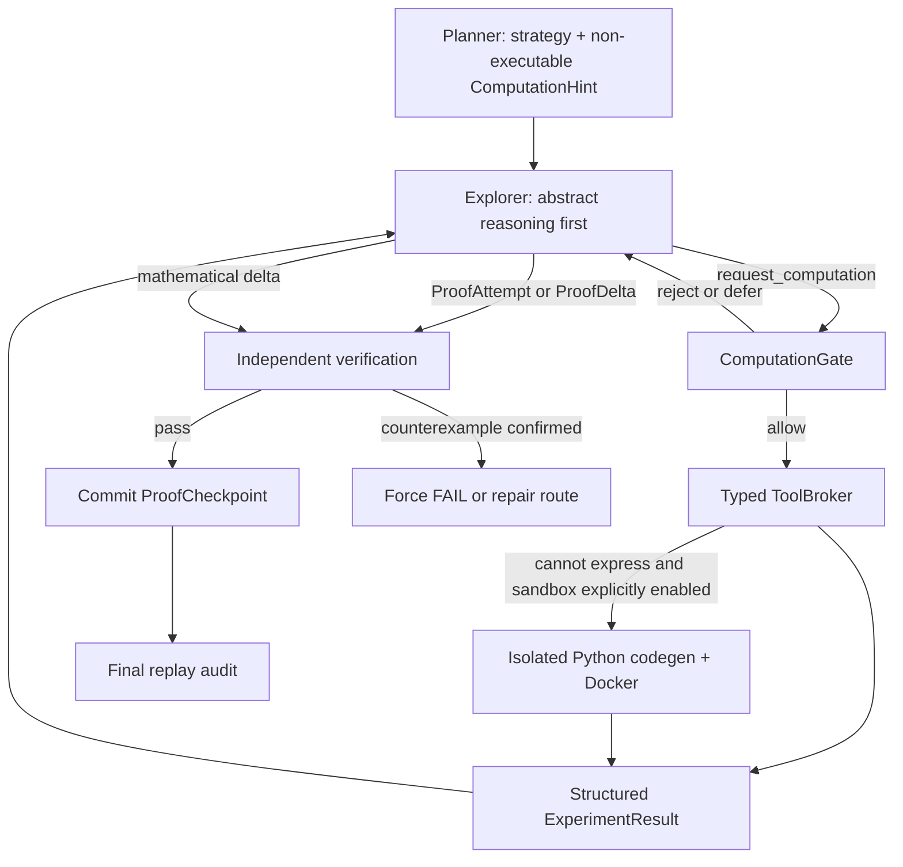

# MathProofMesh

MathProofMesh 是面向高难度数学证明、逻辑推演和研究型推理任务的多智能体系统。它强调四件事：**隔离探索、抽象推理优先、独立验证、可恢复执行**。

当前源码版本为 **0.7.0**；实际包版本以 `pyproject.toml`、`BUILD_INFO.json` 和 `mathproofmesh.__version__` 为准。

> `verified` 表示结果通过了当前配置的独立审计链，并不等价于 Lean、Coq 或 Isabelle 内核证明。高风险结论仍应由领域专家或形式化证明助手复核。

## 0.7.0 核心变化

0.7.0 在推理优先计算协议之上增加了可选的分层稀疏协作拓扑。跨路线信息不再是自由文本，而是经过证据、作用域、独立审稿、去重、限流和回执门控的数学对象；Proof Obligation Graph 显式记录开放目标、依赖、冲突和 proof debt。

本版本完整加入 P0 `Inspiration Engine`，不是普通 `widen` 的别名：

- `Representation Switchboard` 主动切换数学表示，并记录对象映射、保持条件、损失风险和快速失败测试；
- `Analogy Agent` 只检索本地已验证题库，显式列出不可迁移条件；
- `Auxiliary Construction Inventor` 与 `Invariant / Monovariant Agent` 生成绑定开放义务、可快速证伪的候选；
- `Reverse Goal Analyzer` 从目标倒推最小桥梁缺口；
- `Persistent Meta-Strategist` 根据 proof debt、重复首错、路线冗余和预算持续重规划；
- `Surprise Budget Explorer` 保留少量高新颖性预算，但绝不侵占最终综合、审计和修订储备；
- `Novelty Signature` 识别“换措辞但同机制”，`Inspiration Referee` 独立门控所有提案。

Active 灵感任务现在不是“一种机制只问一次模型”。每个获准任务默认并行生成 3 个独立候选：2 个只读取少量相关 Broker Fact、NegativeMemory 和目标子图的 `warm` 候选，以及 1 个隐藏旧路线证明文本、只保留原题、目标义务和禁止重复机制列表的 `cold` 候选。系统先用规范化数学机制本体和 Novelty Gate 去重，再最多独立审查 2 个候选、最多物化 1 条路线。不同任务和不同数学方向没有新增全局串行锁；限制针对的是同一任务内的候选数量、重复机制和总预算。

候选生成、Referee、快速 Skeptic 与首次真实路线尝试在调用前作为一个完整周期预留预算；被拒绝或未使用的调用额度会释放。Checkpoint、Activity 和 `reports/hierarchical_metrics.json` 会记录 warm/cold 数量、候选筛选结果以及预留、消耗、释放和超额调用数。Novelty 标签同时保存模型原始标签、规范化标签与未知扩展标签，未知标签只能提供弱相似度提示，不能单独把新路线判成重复。

通用配置仍默认 `legacy_sparse`。DeepSeek 正式版和冒烟版先以 `proof_graph: shadow`、`inspiration: shadow` 观察诊断；实验配置 `config.deepseek-v4-pro.topology-active.yaml` 才会正式让图和灵感提案改变调度。

二次符合性审计指出的运行闭环现已收口：`hierarchical_sparse` 的 Route Prover 不再读取旧 `LemmaMemory` 的跨路线 Claim；Receipt 会独立回传并校验有序量词与变量绑定；Prover、Skeptic、Tool Specialist、Referee 强制相互独立；Active 拓扑强制启用 continuation；Validation Escalation 会执行而不只生成计划；domain-role Capability 参与派工；盲终审包含匿名化的 Typed Fact/Negative provenance；灵感任务在模型调用前经过统一预算准入；消息只有被已验证 Delta 实际引用后才获得 utility；计算证据由真实 Tool Specialist Agent 审计。上述阶段逻辑已分别下沉到 `route_pipeline.py`、`broker_phase.py`、`inspiration_phase.py`、`cross_route_phase.py`、`synthesis_phase.py` 和 `resume_phase.py`。

第二批灵感升级把 `Persistent Meta-Strategist` 从普通建议生成器改为真实控制面：模型输出先转换为 `MetaDirective`，经过路线、可观测证据、有效期和收尾预算审计后，才能执行路线合并、降温、放弃，或生成一个仍需普通调度准入的机制任务。Directive、审计和执行结果不会进入 InsightMemory 或 FactMemory；shadow 模式只记录而不修改路线。

系统同时维护 `InspirationOutcome` 结果账本，记录每个提案的调用与 token 成本、物化结果、verified Fact 增益、proof debt 变化、关闭义务、反驳和最终证明引用。机制调度使用带最低探索率的确定性 UCB，在相同领域、触发类型和义务类型下学习哪些机制更有效，但奖励只能改变任务排序，不能成为数学证据。只有后来通过 Broker Fact Gate 的提案才会被 `Verified Experience Distiller` 提炼进正面类比经验；失败类比进入独立 Negative Analogy Library，防止同一题反复进行已知失败的迁移。

第三批灵感升级补齐了领域算子、受控变异、双向边界和组合式灵感。数论、组合、不等式和几何算子不再只是提示词标签，而是带有前置条件、变换、派生义务、可逆性要求、快速失败测试、已知失败模式和建议工具的 `DomainOperatorSpec`。`Surprise Budget Explorer` 使用带固定种子的 `SurpriseMutationDirective` 执行对偶、补结构、商结构、提升、投影、极值化、逆操作、局部到整体及图/多项式/状态机编码；模型无法偷偷改写已经获准的变异指令。

`Reverse Goal Analyzer` 现在维护仅由 Broker admitted Typed Facts 构成的前向边界和由目标充分条件构成的后向边界，只把两者之间缺失的最小蕴含登记为桥接义务。`InspirationComposer` 只组合指向相同或相邻义务、机制互补、已经独立审查且至少一个通过快速反驳检查的提案；组合结果在后续调度轮作为全新提案再次经过 Referee 和 Skeptic，不能直接进入 FactMemory。经最终证明实际引用的正面经验、失败类比和可观测结果账本可以写入 git 忽略的 `.mathproofmesh/learning`，供后续运行检索和 UCB 调度；其中不保存 Prompt、私有思维链、API 输出或密钥。

## 0.6.0 推理优先计算基础

0.6.0 在 0.5.1 的验证式多 Agent 工作流上增加了“推理优先计算协议”。目标不是让系统优先穷举，而是把必要的数值检查从长篇推理文本中抽离出来，用可审计、受预算约束的工具完成。

不可破坏的原则：

- 抽象逻辑推理始终优先，Python 不能成为默认路线生成器。
- 便宜、精确、定向的反驳可以尽早执行，避免在错误猜想上继续消耗大量 tokens。
- 广泛枚举和模式搜索只能在路线停滞后，由 Meta-Reviewer 明确批准。
- 反例的证据门槛低；正面计算结论的证明门槛高。
- `not_refuted` 只表示“未发现反例”，永远不表示 `verified`。
- 实验结果不能直接进入 Claim 库，也不能单独推进 `ProofCheckpoint`。
- 强类型工具优先；模型生成 Python 只允许作为默认关闭的隔离后备路线。

## 系统能力

- **一 key 一 Agent**：规划、探索、审查和综合角色拥有独立调用、限流、重试和使用量记录。
- **稀疏通信**：初始 Explorer 相互隔离；跨路线信息通过 Claim、验证报告和 Meta-Reviewer 传递。
- **两级验证**：先审查题意、依赖和结构，再进行逐步数学审计与反例检查。
- **证明检查点**：长证明拆成 `ProofDelta`；只有通过本地守卫和独立 Reviewer 的增量才会提交。
- **断线接力与恢复**：同 key 重试失败后可跨 key 接力；进程重启后可从最近已验证检查点继续。
- **无正文失败诊断**：若深度调用耗尽推理预算却没有返回结构化正文，系统只从最近已验证检查点执行一次小型 `PostFailureBottleneckExtractor`，将最小卡点登记为路线局部义务并定向触发灵感机制；它不会声称恢复私有思维链，也不会把诊断提升为 Fact。
- **失败感知调度**：根据执行、计划或策略失败决定修补、拓宽或停止。
- **推理优先计算**：Explorer 可提交 `ExperimentSpec`，但计算门控、工具执行和证明推进彼此隔离。
- **分层稀疏拓扑**：每条路线拥有局部团队、收件箱和检查点；跨路线只共享 Broker 门控后的结构化对象。
- **三层记忆与证明图**：Fact、Insight、Negative 严格分层，反例可失效依赖事实并重新打开义务。
- **专门灵感机制**：表示切换、结构类比、辅助构造、不变量、逆向目标、持续元策略和 Surprise Budget 按可观测停滞触发。
- **盲终审与升级验证**：最终 Judge 不接收作者、路线排名、投票、自信度或历史审稿；高风险内容可升级到对抗审稿、工具或形式化微证书。
- **证据重放终审**：终审会校验请求哈希、工具版本、结果哈希，并重放关键实验。
- **可追溯产物**：保存提示、结构化结果、检查点、实验、验证报告和 Activity 时间线，不传播模型私有思维链。

## 快速开始

### 安装或复用环境

Windows PowerShell：

```powershell
cd <MathProofMesh 仓库目录>

# 仅第一次需要创建虚拟环境
python -m venv .venv
Set-ExecutionPolicy -Scope Process Bypass
.\.venv\Scripts\Activate.ps1
python -m pip install -e ".[dev,server]"
```

Linux 或 macOS：

```bash
python -m venv .venv
source .venv/bin/activate
python -m pip install -e ".[dev,server]"
```

Python 要求为 **3.11 或更高版本**。主依赖已包含 SymPy、NetworkX 和 Z3；普通拉取只有在 `pyproject.toml` 的依赖发生变化时才需要重新安装。

不使用外部 API 的确定性演示：

```powershell
mathproofmesh demo --run-root demo-runs
mathproofmesh demo --continuation --run-root demo-runs
```

`demo` 使用 Mock Agent，不需要 API key，也不会产生模型费用。

### 配置 DeepSeek API key

两个 DeepSeek 预设配置都会读取五个环境变量。真实 key 不应写入 YAML、日志或 Git：

```powershell
$env:DEEPSEEK_AGENT_1_KEY="..."
$env:DEEPSEEK_AGENT_2_KEY="..."
$env:DEEPSEEK_AGENT_3_KEY="..."
$env:DEEPSEEK_AGENT_4_KEY="..."
$env:DEEPSEEK_AGENT_5_KEY="..."
```

`$env:` 只对当前 PowerShell 窗口有效。需要跨终端保存时，可写入当前 Windows 用户环境变量，然后重新打开 PowerShell：

```powershell
[Environment]::SetEnvironmentVariable("DEEPSEEK_AGENT_1_KEY", "...", "User")
```

仓库中的 `.env.example` 只说明变量名；CLI 不会自动加载 `.env`。

先做不收费的配置检查，再按需发出小型真实请求：

```powershell
mathproofmesh probe --config config.deepseek-v4-pro.yaml
mathproofmesh probe --config config.deepseek-v4-pro.yaml --completion
```

### 运行

冒烟版：

```powershell
mathproofmesh solve examples/problem.txt `
  --config config.deepseek-v4-pro.smoke.yaml `
  --run-id smoke-001
```

正式版：

```powershell
mathproofmesh solve examples/problem.txt `
  --config config.deepseek-v4-pro.yaml `
  --run-id imo-hard-001
```

恢复中断运行：

```powershell
mathproofmesh resume imo-hard-001 --config config.deepseek-v4-pro.yaml
```

输出完整 JSON 或调整 Activity：

```powershell
mathproofmesh solve examples/problem.txt --config config.deepseek-v4-pro.yaml --json
mathproofmesh solve examples/problem.txt --config config.deepseek-v4-pro.yaml --activity detailed
```

Activity 只显示阶段、任务和结构化结果摘要，不显示原始 `reasoning_content`。

## DeepSeek 配置档位

| 配置 | 冒烟版 | 正式版 |
| --- | ---: | ---: |
| 文件 | `config.deepseek-v4-pro.smoke.yaml` | `config.deepseek-v4-pro.yaml` |
| Agent 数 | 5 | 5 |
| 单个 Agent 输出上限 | 50,000 tokens | 100,000 tokens |
| 单个证明分段输出上限 | 50,000 tokens | 100,000 tokens |
| 每段最多新增结构化步骤 | 8 | 12 |
| 每条路线最多分段数 | 4 | 12 |
| 初始路线 / 最大路线 | 2 / 3 | 3 / 6 |
| 最大调度轮数 | 2 | 4 |
| 整个 run 最大模型调用数 | 28 | 42 |
| 整个 run token 预算 | 300,000 | 2,000,000 |
| 配置费用上限 | USD 0.75 | USD 5.00 |
| 强类型计算工具 | 开启 | 开启 |
| 模型生成 Python 沙箱 | 开启（需 Docker） | 开启（需 Docker） |

“正式版最多 12 步”指 `continuation.max_new_steps_per_call: 12`：一次分段调用最多提交 12 个新的结构化证明步骤。它不表示整道题只能有 12 步。正式版每条路线最多 12 个分段，仍受总调用、总 token、费用和调度预算限制。

高预算 Active 拓扑配置把供应商硬上限与日常运行上限分开：`provider_max_output_tokens: 384000` 只用于校验供应商能力，Agent 与单段证明的最高可准入档位为 `128000`。该配置仍保留 150 次调用和 10,000,000 tokens 的整次运行硬上限，但调度器会保护综合、终审与修订储备。

### 深度探索档位与重复抑制

Active 拓扑使用 `32K / 64K / 96K / 128K` 四档。`provider_max_output_tokens: 384000` 仍只是供应商能力上限；实际每次调用由服务端准入器选择下面的运行档位：

| 档位 | 无正文时间上限 | 整次调用上限 | 答案预留 | 无正文 token 截止 |
| ---: | ---: | ---: | ---: | ---: |
| 32K | 8 分钟 | 12 分钟 | 8K | 24K |
| 64K | 12 分钟 | 18 分钟 | 8K | 56K |
| 96K | 18 分钟 | 25 分钟 | 12K | 84K |
| 128K | 25 分钟 | 32 分钟 | 16K | 112K |

时间与 token 截止是双重保护。若模型长时间只有 `reasoning_content` 而没有结构化正文，运行器会在对应阈值中止本次调用，而不是让它把整个档位全部消耗掉。已产生的 reasoning token 仍计入该路线和全局预算，但不会被误记为证明进展。

档位不再按 `segment_index` 自动增长，而是按证据逐级准入：

1. 新路线或尚无已验证检查点的路线从 32K 开始。
2. 已有已验证检查点，但当前机制尚无本轮已验证推进时，通常准入 64K。
3. 同一机制已经产生已验证推进，且当前给出明确的关键局部目标时，才可准入 96K。
4. 同一机制先在 96K 取得已验证推进，同时通过 Meta-Strategist 审批，并保留至少 8 次调用和 256K tokens 的收尾预算后，才可准入 128K。
5. 新检查点、已验证反例或 Referee 确认的机制转向可以形成新的有效状态；单纯“再想一次”不能升级档位。

### 哪些高档探索可以并行

系统没有设置“全局只能有一个 96K/128K 调用”的限制。只要数学签名不同，以下探索可以同时运行，并继续受现有 Agent 并发数和总预算约束：

- 不同领域的路线，例如数论、组合和几何；
- 同一领域里的不同子方向；
- 同一局部目标上的不同证明机制；
- 路线推进到新检查点后产生的新局部义务；
- 某个困难小步被 Referee 确认为需要换机制后的局部转向。

去重签名包含问题、已验证检查点、目标义务、机制、表示、辅助构造、不变量、变换和假设。路线 ID 以及“数论/几何”等宽泛领域标签不参与规范哈希，因此换路线名或复制 Agent 不能绕过限制；真正不同的数学目标或机制也不会被错误地全局串行化。语义近似但不确定的签名不会直接永久封锁，而是降到最多 64K，并要求一次快速 Novelty Review。

### 无进展、局部换向与安全恢复

一次 96K/128K 调用若没有产生已验证增量、可用局部结果或有效反例，系统会给该数学签名记一次 strike 并锁定继续高档重复。锁定后最多允许一次不超过 64K 的有界修复；仍无进展时必须改变目标、机制或等待新的已验证检查点，不能对同一状态反复烧掉 96K/128K。

若路线已经推进到一个已验证检查点，只是当前小步长期无法解决，系统保留父检查点，并可将最小卡点登记为 route-local Proof Obligation。经 Referee 确认的新机制会登记为 `BottleneckPivotRecord`，由 Inspiration Engine 针对这一个小步尝试表示切换、类比、辅助构造、不变量或逆向目标，而不是丢弃整条路线重新开始。

若深度调用因达到长度或时间上限而完全没有正文，系统不会假装恢复模型的私有思维过程。它只允许从调用前的已验证外部检查点进行一次 32K 恢复；仍失败时再执行一次最多 12K 的 `PostFailureBottleneckExtractor`。该诊断只提取可审计的 `current_goal`、最小阻塞命题、依赖、已尝试机制和备选机制，并定向触发 Inspiration。诊断结果保持路线局部状态，不会直接进入 FactMemory、关闭 ProofCheckpoint 或让最终证明通过。

### 持久化与审计

深度探索的 lease、数学签名、档位、strike、锁、局部 pivot、token 用量和结论会写入：

- `structured/deep_exploration_registry.json`：用于 checkpoint/resume；
- `reports/deep_exploration.json`：用于运行后审计；
- Activity 时间线：记录准入、降档、Novelty Review、完成、锁定和局部 pivot 事件。

进程恢复时不会续接未公开的模型内部思考。未完成的 lease 会记为 `interrupted`，高档调用仍保留对应 strike，防止重启进程绕过重复消耗门控。只有独立验证通过的证明增量才能创建新检查点并解除旧状态的锁。

### 本轮升级的代码落点

| 位置 | 具体变化 |
| --- | --- |
| `src/mathproofmesh/deep_exploration.py` | 新增数学状态签名、四档准入、原子 lease、近重复检测、高档无进展锁、路线 token 归因和局部机制 pivot |
| `src/mathproofmesh/stall_recovery.py` | 新增无正文失败后的单次瓶颈提取与检查点级幂等保护 |
| `src/mathproofmesh/agents.py` | 按档位执行无正文时间、整次调用时间和答案 token 预留；保留网络断线与 key failover 行为 |
| `src/mathproofmesh/orchestrator.py` | 将准入、结束判定、局部义务、Inspiration 触发、恢复和 Activity 接入正式路线闭环 |
| `src/mathproofmesh/config.py` 与 Active YAML | 增加 32K/64K/96K/128K 策略、128K 审批与收尾储备、重复修复上限和 12K 瓶颈诊断配置 |
| `src/mathproofmesh/resume_phase.py` 与 `report.py` | checkpoint 持久化 deep-exploration 状态，并生成独立审计报告和汇总指标 |
| `tests/test_deep_exploration_*.py` 与 `tests/test_post_failure_bottleneck.py` | 覆盖并行不同签名、阻止相同高档重复、逐档升级、128K 门控、局部换向、无正文恢复、resume 和报告 |

旧 checkpoint 恢复也采用 fail-closed 路线：即使中断发生在 triage 完成、strategy 尚未生成的窗口，恢复后也会先幂等注册每个 Strategy 的 Route、补齐 Prover、重算稀疏邻居并保存拓扑，之后才允许继续证明。实际选中的 Prover 会同步回 RouteRegistry；`hierarchical_sparse` 若缺少 Route、Broker 或 TypedMemory 会明确失败，绝不静默回退到 legacy `proof_continuation`。

hierarchical 报告把 `Broker-admitted global Fact` 与 `Legacy ClaimMemory history` 分开。全局 Fact 计数只接受 Broker 已准入、独立 Referee 已记录且仍存在于 TypedMemory Fact 层的交集；旧 checkpoint 的 verified Claim 只能作为迁移历史展示，不能获得全局事实资格。对应清单写入 `reports/global_fact_inventory.json`。

全局 Fact 上下文现在按 `ContextPurpose` 区分 verification、synthesis、blind review 和 revision 的排序字段与字符预算。证明显式引用的 `message_id/content_hash` 及其完整依赖闭包始终先于词法相似度；引用未通过 Broker Fact Gate 或必需闭包装不进预算时，最终审查 fail closed。Blind NegativeMemory 使用“全部精确反例/显式冲突强制保留，再按相关性、证据强度和中心性补充”的有界选择；若强制负面证据仍无法装入，禁止最终 PASS。

Blind packet 不再暴露 `artifact://` 原始路径，只携带实际文件内容的 SHA-256、证书类型和 replay 状态。这样不会通过文件名泄漏 Agent/Route，同时保留可审计证据身份。

本轮离线验收基线为：安装 `.[dev,server]`（包含 `z3-solver`）后 `226 passed`、Ruff check 通过、Ruff format check 通过、`compileall` 通过、topology component-contract Mock benchmark 通过且真实 provider 调用数为 0。该 Mock benchmark 验证组件契约和消融开关，不代表真实 IMO 求解性能。

## 推理优先计算流程



计算请求不会增加 `segment_index`，不会提交检查点，并从同一父检查点交还给同一 Explorer。默认每个分段最多一次计算往返。

### 计算门控

`ComputationGate` 的主要规则：

- 目标命题不精确、没有数学依据或没有决策用途：`reject`。
- “枚举看看规律”一类初始请求：`reject`；精确定义的广泛搜索在尚未停滞时：`defer`。
- 精确、低成本的 `falsify_claim`：可走定向反驳快速通道，不要求先停滞。
- `discover_pattern` 或 `broad_search`：必须满足停滞轮数并获得 Meta-Reviewer 批准。
- 相同请求和相同工具环境已执行：读取缓存，不重复计算。
- 没有足够模型预算解释计算结果：`defer`。
- 超过路径软配额：等待 Meta-Reviewer；超过硬配额：`reject`。

### 证据等级

| 结果 | 证据等级 | 系统含义 |
| --- | --- | --- |
| 随机样本未发现反例 | `heuristic` | `not_refuted`，不能提升 PASS |
| 有限范围完整检查 | `bounded_evidence` | 只覆盖声明范围 |
| 候选反例经强类型工具重算 | `counterexample` | 若证明仍使用被反驳命题，覆盖模型 PASS 并强制 FAIL |
| 完整有限枚举 | `exhaustive_certificate` | Reviewer 仍须验证有限归约覆盖原题 |
| 精确符号或形式证书 | `formal_certificate` | Reviewer 仍须检查自然语言命题映射 |
| 工具超时、缺依赖或异常 | `heuristic` + `inconclusive` | 计算无结论，不代表数学失败 |

### 强类型工具

| 方法 | 实现 | 正面证据边界 |
| --- | --- | --- |
| `sympy_simplify` / `sympy_equivalent` | SymPy 安全表达式解析 | 只支持精确符号化的声明 |
| `modular_exhaustive` | 全部声明剩余类 | 必须覆盖所有剩余类，且有限归约被 Reviewer 接受，才可支持原命题 |
| `bounded_integer_search` | Z3 + 独立整数重算 | 只覆盖声明的有限域 |
| `graph_certificate` | NetworkX + 独立属性检查器 | 只证明证书对应的图性质 |
| `recurrence_check` | `int` / `Fraction` | 只覆盖声明区间 |
| `exact_geometry` | 有理坐标、行列式和平方距离 | 只覆盖给定坐标断言 |
| `numeric_counterexample` | 固定种子抽样 + 精确回代 | 只能反驳，不能证明 |
| `lean_check` | 可选外部 Lean | 接受后仍要审查命题映射 |

## 计算配置

DeepSeek 冒烟版和正式版默认启用强类型工具：

```yaml
computation:
  enabled: true
  policy: reasoning_first
  typed_tools_enabled: true
  sandboxed_python_enabled: false
  execute_planner_hints_immediately: false
  targeted_falsification_fast_path: true
  soft_experiments_per_path: 2
  hard_experiments_per_path: 6
  max_compute_cycles_per_segment: 1
  max_total_cpu_seconds: 120
  max_cases_per_experiment: 1000000
  max_output_chars: 20000
  broad_search_after_stalled_rounds: 1
  broad_search_requires_meta_review: true
  cache_results: true
```

通用 `config.example.yaml` 默认关闭计算协议，以兼容旧的 `ProofAttempt` / `ProofDelta` 响应格式。

### Python 沙箱

模型生成 Python 默认关闭。启用时必须显式配置带不可变 digest 的镜像，例如：

```yaml
computation:
  enabled: true
  sandboxed_python_enabled: true
  sandbox_image: registry.example/mathproofmesh-python@sha256:<64位十六进制摘要>
```

仓库随附的 DeepSeek 冒烟版和正式版已经显式启用沙箱，并固定到配置文件中的官方
Python 3.11 镜像摘要。安装 Docker Desktop 后可运行真实隔离探针：

```powershell
python scripts/verify_sandbox.py --config config.deepseek-v4-pro.smoke.yaml
python scripts/verify_sandbox.py --config config.deepseek-v4-pro.yaml
```

运行器按无网络、只读根文件系统、非 root 用户、无工作区挂载、空宿主环境、CPU/内存/进程/超时/输出限制构造 Docker 命令。生成源码禁止 `open`、`exec`、`eval`、`compile`、`subprocess`、`socket`、动态导入和私有属性访问。输入输出必须符合 JSON Schema，输入 Schema 必须声明固定种子，输出 Schema 必须声明标准结果字段。

模型生成 Python 的正面结果最高只能是 `bounded_evidence`。它给出的反例候选若不能由强类型检查器独立复现，会被降级为 `inconclusive`。

每次执行会保存规范化输入、原始 Handler 输出、系统接受的结构化结果、程序哈希和环境哈希；最终审计会校验这些记录以及关键证据的确定性重放。

## 运行产物

```text
runs/<run_id>/
|-- events.jsonl
|-- activity.jsonl
|-- prompts/
|-- raw/
|-- structured/
|-- tools/
|-- deltas/
|-- checkpoints/
|   |-- *_latest.json
|   |-- runtime_ledger.json
|   `-- proof/<path_id>/
|       |-- 0000_*.json
|       |-- 0001_*.json
|       `-- latest.json
|-- experiments/
|   |-- ledger.json
|   `-- <request_hash>/
|       |-- spec.json
|       |-- decision.json
|       |-- program.json / program.py   # 仅沙箱后备路线
|       |-- execution.json
|       |-- result.json
|       `-- evidence.json
`-- reports/
    |-- final_experiment_audit.json
    |-- run_report.md
    `-- activity_timeline.*
```

缓存键包含规范化请求、工具版本、沙箱镜像 digest、精度和随机种子。`resume` 会复用已完成实验，不重复执行或计费。

## 拉取新分支后继续使用

保留同一个 Git 仓库目录即可复用 `.venv` 和用户级 API 环境变量：

```powershell
git fetch origin
git switch <branch-name>
git pull --ff-only
.\.venv\Scripts\Activate.ps1
```

普通源码更新不需要重装。只有 `pyproject.toml` 的依赖、入口点或构建配置变化时，再执行：

```powershell
python -m pip install -e ".[dev,server]"
```

## HTTP 服务

```powershell
$env:MATHPROOFMESH_SERVER_TOKEN="replace-with-a-long-random-token"
mathproofmesh serve --config config.deepseek-v4-pro.yaml --host 127.0.0.1 --port 8000
```

服务提供 `/solve`、`/solve/stream`、`/resume` 和 `/resume/stream`。公开部署时应在反向代理增加 TLS、请求大小限制、速率限制和访问控制。

## 验证与基准

```powershell
python -m pytest -q
python -m ruff check .
python -m ruff format --check .
python -m compileall -q src
python benchmarks\reasoning_first_computation.py
python -m benchmarks.topology.run_mock_benchmark
```

0.7.0 在全部 0.6.0 回归测试之外，还覆盖：

- 简单证明不触发计算；
- 首轮模糊模式搜索被拒绝；
- 精确错误猜想走定向反驳快速通道；
- `not_refuted` 不会升级为证明；
- 独立复核反例覆盖模型 PASS；
- 计算往返不能单独推进检查点；
- 广泛搜索需要停滞和 Meta-Reviewer 批准；
- 工具异常只产生无结论结果；
- 缓存和恢复不重复执行；
- 沙箱 AST 规则和 Docker 命令构造不暴露网络、API key 或项目工作区；
- 离线枚举密集代理基准检查结构化计算显著减少推理文本，并保持已知答案正确率。
- Typed Message 哈希、作用域、Fact evidence gate、稀疏投递和 exactly-once resume；
- Route Team 独立审稿、Proof Graph 生命周期、Bridge/Conflict 和机制级重复路线；
- 完整 Inspiration Engine 触发、八类机制、Novelty Gate、shadow/active、预算保护与幂等恢复；
- Validation Escalation、Agent x Domain x Role capability 和形式化微证书安全降级；
- 六个离线拓扑场景和十一组规定消融，不使用真实 API。

离线 token 基准是“显式逐例文本”与“结构化请求/结果”的可重复代理，不声称测量供应商隐藏推理 tokens。当前代理基准 3/3 结果正确，估算可见文本减少 99.97%。真实 DeepSeek 成本和准确率回归需要 API key，因此不会在默认测试中调用。固定摘要镜像的 Docker 实机探针已分别通过冒烟版和正式版配置，结果保持为 `bounded_evidence`。

## 文档

- [推理优先计算策略、Schema、门控与证据语义](docs/COMPUTATION_POLICY.md)
- [系统架构、通信拓扑与预算](docs/ARCHITECTURE.md)
- [分层通信拓扑](docs/COMMUNICATION_TOPOLOGY.md)
- [Typed Message 协议](docs/TYPED_MESSAGE_PROTOCOL.md)
- [Proof Obligation Graph](docs/PROOF_OBLIGATION_GRAPH.md)
- [Typed Memory](docs/TYPED_MEMORY.md)
- [Inspiration Engine](docs/INSPIRATION_ENGINE.md)
- [Validation Escalation](docs/VALIDATION_ESCALATION.md)
- [Agent Capability Profile](docs/AGENT_CAPABILITY_PROFILE.md)
- [从 0.6 迁移到 0.7](docs/MIGRATION_0.7.md)
- [DeepSeek V4 Pro 配置](docs/DEEPSEEK_V4_PRO.md)
- [证明检查点、断线接力与进程恢复](docs/CHECKPOINT_RESUME.md)
- [Activity 时间线与 SSE](docs/ACTIVITY_TIMELINE.md)
- [部署与扩展](docs/DEPLOYMENT.md)
- [可复现验证记录](docs/VALIDATION.md)
- [0.7.0 发布说明](RELEASE_NOTES_0.7.0.md)
- [0.6.0 发布说明](RELEASE_NOTES_0.6.0.md)

## 安全与正确性边界

- 不要把真实 API key 写入 YAML、源码、Issue、截图或 Git 历史。
- 随机测试没有找到反例不构成证明；有限检查不会自动推广到无限命题。
- 反例只有在独立可信检查器复现后才能覆盖模型判断。
- `ProofCheckpoint` 恢复的是已外部化、已验证的数学状态，不是供应商服务器中的隐藏解码状态。
- Planner 的 `ComputationHint` 永远不会自动执行。
- 模型置信度只是调度元数据，不能把未审计 Claim 升级为已验证事实。
