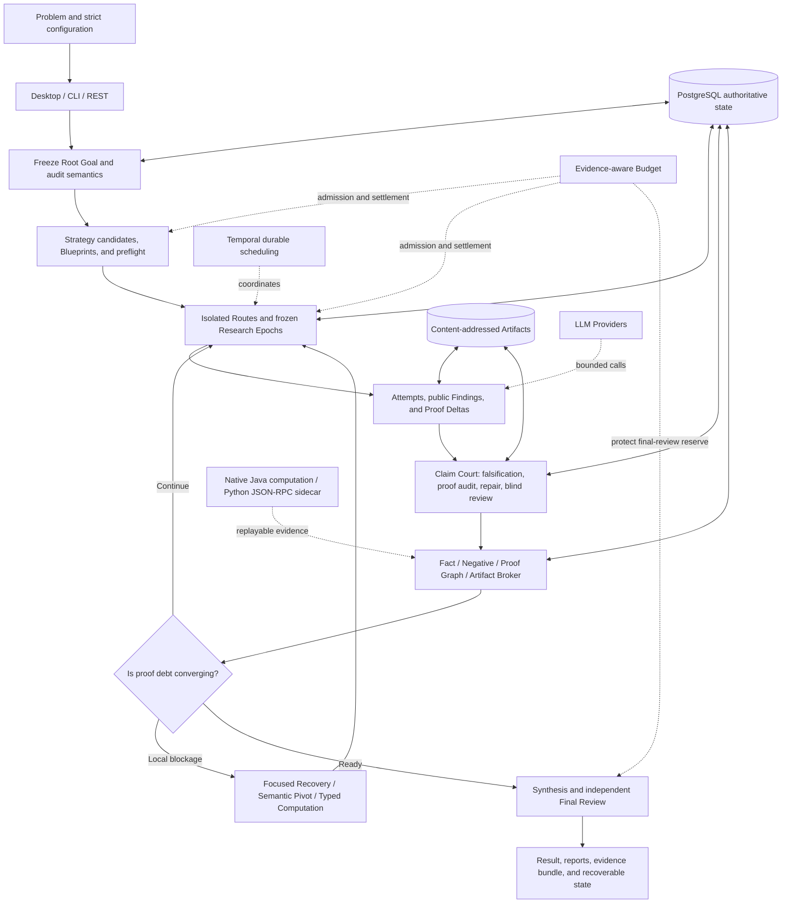
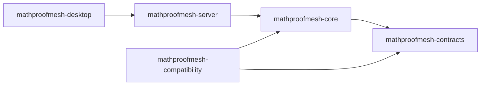

# MathProofMesh

> A durable, auditable multi-agent mathematical proof research system built on Java 25.

MathProofMesh targets olympiad problems, difficult proofs, logical deduction, and research-style mathematical reasoning. It is not a group chat in which several models freely debate. Instead, it decomposes a solve into bounded **Strategies, Routes, Attempts, Claims, Proof Obligations, Evidence, and Reviews**, then uses deterministic Java policies, independent review, durable state, and resource budgets to govern how those objects are created, moved, promoted, invalidated, and recovered.

The current Java product line is **0.8.0**. The project has completed its migration from a frozen Python authority to a Java 25 modular monolith, while the Issue 001-014 repair records document continuing validation of its semantic, evidence, concurrency, budget, and recovery boundaries under a real five-key olympiad benchmark.

Version numbers need one important distinction: the root `pom.xml` and Java release bundle are currently `0.8.0`. [Python 0.8.1](docs/legacy/python-release-notes/RELEASE_NOTES_0.8.1.md) and [Python 0.8.2](docs/legacy/python-release-notes/RELEASE_NOTES_0.8.2.md) are preserved historical compatibility lines. Java can import those legacy run formats read-only, but they are not the current Java artifact version.

> **Verification boundary:** `VERIFIED` means that a result passed the configured structural checks, evidence gates, and independent review chain. It does not automatically mean that Lean, Coq, or Isabelle has accepted a kernel-level formal proof. High-risk results still require expert or formal-system review.

## Contents

- [What the project solves](#what-the-project-solves)
- [Core design principles](#core-design-principles)
- [End-to-end solve path](#end-to-end-solve-path)
- [Issue 001-014 capability chain](#issue-001-014-capability-chain)
- [System architecture](#system-architecture)
- [Technology stack](#technology-stack)
- [Repository layout](#repository-layout)
- [Quick start](#quick-start)
- [Configuration and providers](#configuration-and-providers)
- [Data, recovery, and security](#data-recovery-and-security)
- [Testing and release gates](#testing-and-release-gates)
- [Five-key olympiad benchmark](#five-key-olympiad-benchmark)
- [Documentation index](#documentation-index)

## What the project solves

Language models can produce promising proof ideas quickly, but the main risks in difficult mathematical work are usually not a lack of ideas. They appear at the boundaries:

- a translation, summary, or later prompt changes the original quantifiers, scope, or conclusion;
- several apparently different routes are only stylistic variants of the same unverified mechanism;
- a failed Route discards local Claims that were already independently established;
- failure to find a counterexample is misread as proof;
- a bad proof is confused with a false statement, or a locally repairable proof is rejected wholesale;
- a cross-route message is marked delivered even though no later proof actually used it;
- public intermediate findings disappear after truncation, malformed JSON, or process termination;
- multi-key concurrency creates duplicate calls, credential races, nondeterministic merges, or partial authority writes;
- call, token, and cost budgets are checked too late to preserve final synthesis and review capacity;
- Checkpoints, results, usage ledgers, and UI state disagree, leaving recovery without a clear source of truth.

MathProofMesh turns these risks into **typed, testable, durable, replayable system state**. The final output is more than a proof-shaped answer. It includes the root-goal hash, strategy and route lineage, Claim adjudication, Proof Graph state, computation certificates, provider usage, Checkpoints, recovery records, and an independent final-review result.

Typical use cases include:

- olympiad number theory, combinatorics, algebra, inequalities, geometry, and functional equations;
- research problems that benefit from parallel routes and counterexample-first diagnosis;
- long-running reasoning that needs restart recovery, spending limits, and a complete audit trail;
- reproducible comparisons across models, agent roles, and proof mechanisms.

It is not:

- a free-form agent chat framework;
- an agent that executes arbitrary model-generated Python by default;
- a system that treats model confidence, votes, or route popularity as mathematical evidence;
- a theorem prover that produces kernel-checked formal proofs by default.

## Core design principles

### 1. The original goal is immutable

The input problem is frozen as a `RootGoalContract`, binding the exact text, `goal_hash`, quantifier skeleton, scope, and conclusion shape. An English rendering or semantic view is only a non-authoritative sidecar and cannot replace the main goal.

### 2. Models propose; the server owns authority

Models may propose Strategies, Claims, counterexample candidates, repairs, and Pivots. IDs, hashes, state transitions, evidence levels, graph closure, Fact promotion, and permanent Negative Knowledge remain under deterministic server control.

### 3. Routes are isolated; evidence is shared

Initial Routes do not see one another's proof text, reducing common-mode failure. Cross-route exchange carries typed mathematical Artifacts that have passed scope, provenance, authority, relevance, and capacity checks, not free-form conversation.

### 4. Claims, Attempts, and Routes are adjudicated separately

A successful Attempt does not verify every Claim it contains. A failed Route does not invalidate every local Lemma it discovered. Claims have their own lifecycle, independent reviewers, and monotonic state machine.

### 5. Not finding a counterexample is not a proof

`NOT_REFUTED`, finite samples, model confidence, and route consensus cannot promote a Fact. Evidence gains authority only when it is bound to the exact target, scope, certificate, and independent verification required by policy.

### 6. Every long-running process must be recoverable

Provider calls, research Findings, Claim Court stages, computations, concurrent Epochs, budget Reservations, and Run State all have stable identities and durable frontiers. A retry returns prior work or rolls forward deterministically instead of repeating side effects.

### 7. Scheduling cannot change mathematical truth

Budgets, concurrency, Proof Control, telemetry, and Temporal decide what to run and when. They cannot directly write a Fact, close an Obligation, or modify the frozen problem.

### 8. Billing facts and mathematical progress are separate

A provider call may be billed before a complete semantic Checkpoint exists. Terminal usage may extend monotonically when durable evidence proves the extension, but billing state cannot manufacture mathematical progress.

## End-to-end solve path



A production solve can be summarized in 14 steps:

1. **Load and preflight**: strictly parse YAML, the problem file, agents, providers, concurrency, and budgets. Unknown fields and unsafe paths fail closed.
2. **Freeze the goal**: retain the exact source statement and stable hash, then audit scope, quantifier order, witness uniformity, polarity, and conclusion shape.
3. **Semantic triage**: build a non-authoritative semantic view that identifies the domain, ambiguity, and verification risks without rewriting the Root Goal.
4. **Generate Strategies**: compile candidates into multi-node Blueprints, then derive server-owned mechanism signatures, Claim-local contexts, and executable preflight contracts.
5. **Select a global portfolio**: optimize for mechanism diversity, critical-Claim risk, complementarity, cost, and common-mode failure rather than titles or model scores.
6. **Explore isolated Routes**: each Route owns its team, Attempts, local context, and obligations. Multi-key tasks run concurrently against one frozen Authority Snapshot.
7. **Checkpoint research**: capture bounded public Findings with markers, exact source slices, offsets, and SHA-256. Private chain-of-thought never becomes mathematical authority.
8. **Harvest Artifacts**: separate local lemmas, route theorems, counterexamples, and proof steps. A Route-level verdict never decides all contained Claims in bulk.
9. **Run Claim Court**: freeze Claim semantics, then perform statement falsification, proof audit, bounded local repair, and independent blind adjudication.
10. **Project authority**: only verified Claims may become Facts. Trusted counterexamples enter permanent Negative Knowledge, and the Proof Graph closes or reopens exact Obligations.
11. **Reuse across Routes**: publish typed mathematical Artifacts through the Broker with explicit use manifests, receipts, lineage, and verifiable downstream effects.
12. **Control convergence**: detect duplicate obligations, shared bottlenecks, and stalled rounds, then trigger focused recovery, a representation switch, or a genuine semantic pivot.
13. **Admit budgeted work**: reserve calls, input/output tokens, cost, and final synthesis/review capacity before a complete action enters the ready queue. Uncertified output cannot earn unbounded depth.
14. **Synthesize and recover**: after readiness gates pass, produce a final proof and blind review. Reconcile execution, mathematics, usage, campaign, and report state before exporting a recoverable evidence bundle.

## Issue 001-014 capability chain

The 14 `fix-*` documents form a capability chain from immutable problem semantics to recoverable, billable, replayable real-provider execution. They are not unrelated patch notes.

| Issue | Capability | Core problem addressed | Detailed record |
| --- | --- | --- | --- |
| 001 | Exact Goal Contract | Freezes the original statement and prevents quantifier, scope, witness, and conclusion drift during triage or translation | [fix-001](docs/fix-001-exact-goal-contract.md) |
| 002 | Permanent Negative Knowledge | Separates temporary rejection, trusted counterexamples, and deterministic guardrails, then enforces them at every production and restore entry point | [fix-002](docs/fix-002-permanent-negative-knowledge.md) |
| 003 | Claim / Attempt / Route Separation | Stops Route or Attempt outcomes from deciding Claims in bulk and preserves verified local results from failed Routes | [fix-003](docs/fix-003-claim-attempt-separation.md) |
| 004 | Durable Research Checkpoints | Preserves exactly bound public Findings across truncation, malformed final JSON, exhausted budgets, and restart | [fix-004](docs/fix-004-durable-research-checkpoints.md) |
| 005 | Proof Graph Convergence | Canonicalizes duplicate Obligations, separates raw occurrences, canonical targets, and bottleneck families, and activates bounded focused recovery | [fix-005](docs/fix-005-proof-graph-convergence.md) |
| 006 | Semantic Pivot | Separates local repair from a real change in mathematical object, representation, or direction; every Pivot requires a typed structural delta and independent review | [fix-006](docs/fix-006-semantic-pivot.md) |
| 007 | Strategy Mechanism Diversity | Measures diversity with server-compiled mechanism graphs rather than titles and preflights critical Claims and registered computations | [fix-007](docs/fix-007-strategy-mechanism-diversity.md) |
| 008 | Claim Proof Repair Court | Distinguishes a false statement from an invalid proof and adds bounded repair, role isolation, and blind adjudication | [fix-008](docs/fix-008-claim-proof-repair-court.md) |
| 009 | Mathematical Artifact Broker | Moves verifiable mathematical objects across Routes and distinguishes delivery, explicit use, and proven downstream utility with full attribution | [fix-009](docs/fix-009-mathematical-artifact-broker.md) |
| 010 | Reproducible Computation Evidence | Unifies typed capabilities, immutable evidence bundles, independent certificate verification, exactly-once execution, and native exact experiments | [fix-010](docs/fix-010-reproducible-computation-evidence.md) |
| 011 | Run State Reconciliation | Separates execution, mathematics, usage, campaign, and report state to eliminate Checkpoint/result/UI/ledger split brain | [fix-011](docs/fix-011-run-state-reconciliation.md) |
| 012 | Sustained Multi-Key Concurrency | Uses virtual threads, credential Leases, frozen Epochs, all-settled barriers, and a stable single writer for sustained multi-key work | [fix-012](docs/fix-012-sustained-multi-key-concurrency.md) |
| 013 | Evidence-aware Budget | Admits calls, tokens, cost, and finish reserves before execution, recognizes only hash-bound certified gain, and persists stop policy | [fix-013](docs/fix-013-evidence-aware-budget-token-stop-policy.md) |
| 014 | Structured Output Recovery & Accounting | Repairs structured-output recovery and terminal usage reconciliation, then closes recovery, authority, concurrency, and budget gaps exposed by real five-key cold starts | [fix-014](docs/fix-014-structured-output-recovery-accounting.md) |

Together, these capabilities enforce several non-negotiable invariants:

| Event that is easy to misinterpret | MathProofMesh interpretation |
| --- | --- |
| A model says "proved" | Candidate output, not mathematical authority |
| An Attempt passes | Does not automatically verify every Claim in the Attempt |
| A Route fails | Does not automatically invalidate independently verified local Claims |
| A finite search finds no counterexample | `NOT_REFUTED`, not `VERIFIED` |
| A message is delivered or acknowledged | Does not prove that a later proof used it |
| Several Routes agree | Not independent evidence; they may share a failure mode |
| A Temporal Activity completes | Does not prove that PostgreSQL authority committed |
| A provider call is billed | Does not advance the semantic Checkpoint |

## System architecture

### Module dependencies

MathProofMesh is a **modular monolith**. It keeps strict ownership boundaries without introducing microservice deployment and distributed-transaction costs into the first Java release.



| Module | Responsibility | Boundary |
| --- | --- | --- |
| `mathproofmesh-contracts` | Strict Java records, enums, JSON schemas, canonical JSON, stable hashes, and input validation | No Spring dependency and no orchestration |
| `mathproofmesh-core` | Framework-light domain rules for Proof Control, Memory, Proof Graph, Claim Court, Broker, Computation, Concurrency, Run State, and Verification | No direct network, database, or UI access |
| `mathproofmesh-server` | Spring configuration, REST/SSE/CLI, provider adapters, PostgreSQL/Flyway, Artifacts, the Python sidecar adapter, and Temporal workflows | I/O enters Core through adapters; explicit JDBC replaces JPA/Hibernate |
| `mathproofmesh-desktop` | JavaFX/WebView UI, loopback API, DPAPI credentials, Desktop Coordinator, packaging, and the benchmark production harness | The UI cannot access the database or provider keys directly |
| `mathproofmesh-compatibility` | Read-only Python run import, ordered migrations, shadow comparison, and differential tests | Frozen Python is migration evidence, not a production dependency |

Maven Enforcer, Spring Modulith, and ArchUnit verify the dependency direction. Reverse dependencies, duplicate classes, and ownership violations fail the build.

### Runtime layers

```text
Interface
  Desktop JavaFX/WebView | CLI/Picocli | REST + resumable SSE
        |
Application / Orchestration
  DesktopRunManager | DesktopSolveCoordinator | RunApiService
  StructuredAgentRunner | AgentPool | Temporal Workflows
        |
Domain
  Goal/Strategy/Route/Attempt/Claim | Memory | Proof Graph
  Claim Court | Artifact Broker | Computation | Budget | Run State
        |
Infrastructure
  PostgreSQL + Flyway | Content-addressed Artifact Store
  JDK HttpClient Provider Adapters | Python stdio Sidecar | Observability
```

### Authority ownership

| Data or behavior | Source of truth |
| --- | --- |
| Runs, Claims, Facts, Negatives, Obligations, Checkpoints, provider calls, Leases, Budgets, Outbox/Inbox | PostgreSQL transactional state |
| Desktop Run State in file mode | Versioned, journaled, atomically written `structured/run_state.json` |
| Large prompts/responses, computation certificates, and report attachments | Immutable content-addressed Artifact Store |
| Workflow retries, Signals, Updates, and Continue-As-New | Temporal; it owns durable scheduling, not mathematical truth |
| JGraphT graphs, in-memory Memory, API caches, and Desktop views | Rebuildable projections |
| Model-generated Strategies, Claims, and reviews | Non-authoritative inputs that must pass server gates |
| Python SymPy/Z3 results | Bounded computation evidence whose authority ceiling is set by Java capability policy |

The first Java release deliberately excludes Kafka, Redis, RabbitMQ, and Neo4j. Transactional messaging uses PostgreSQL Outbox/Inbox tables, graph algorithms use JGraphT projections, and caches remain bounded and rebuildable.

## Technology stack

The versions below come from the current `pom.xml`, Maven Wrapper, CI workflow, and dependency locks.

| Layer | Technology | Purpose |
| --- | --- | --- |
| Language and concurrency | Java 25, records, virtual threads, `BigInteger`, exact rationals | Domain models, concurrent research work, and deterministic exact computation |
| Build | Maven 3.9.16, Maven Wrapper 3.3.4 | Five-module reactor with locked and offline-verifiable builds |
| Application framework | Spring Boot 4.1.0, Spring Modulith 2.1.0 | Server, configuration, REST, Actuator, and module boundaries |
| Persistence | PostgreSQL 18.4, Spring JDBC/JdbcClient, Flyway | Authority, CAS, Leases, fencing, Outbox/Inbox, and seven versioned migrations |
| Workflow | Temporal Java SDK 1.37.0 | Two durable workflows, Activity retries, Signals/Updates, replay, and Continue-As-New |
| Graph model | JGraphT 1.5.3 | Proof Graph projections, closure, topological order, bottlenecks, and proof debt |
| JSON and contracts | Jackson Databind 2.21.5 | Strict deserialization, canonical JSON, SHA-256 identities, and versioned snapshots |
| Providers | JDK `HttpClient`, strict JSON/SSE parsers | Direct DeepSeek, Anthropic, Gemini, OpenAI-compatible, and Mock adapters |
| CLI | Picocli 4.7.7 | `solve`, `resume`, `demo`, `probe`, and `serve` commands |
| Desktop | JavaFX 25.0.4, WebView, JNA 5.19.1, Windows DPAPI | Windows x64 application, loopback HTTP/SSE, and local credential protection |
| Python sidecar | Python 3.11+ (CI uses 3.13), SymPy 1.14.0, Z3 4.16.0.0, mpmath 1.3.0 | Fixed-allowlist symbolic/constraint computation over stdio JSON-RPC 2.0 |
| Testing | JUnit 5, AssertJ, Testcontainers 2.0.5, ArchUnit 1.4.2, Temporal Test Environment | Unit, integration, recovery, concurrency, architecture, and differential tests |
| Quality and supply chain | JaCoCo 0.8.15, SpotBugs/FindSecBugs, OWASP Dependency-Check 12.2.2, CycloneDX 2.9.2 | Coverage, static security, vulnerability scans, licensing, and SBOMs |
| Containers and CI | Docker Compose, GitHub Actions, Ubuntu and Windows runners | PostgreSQL/Temporal development, Linux verification, and Windows release bundles |

The provider layer does not use Spring AI or vendor SDKs. MathProofMesh owns request formats, stream termination rules, usage mapping, retry classification, `Retry-After`, ambiguous-result handling, and cost reconciliation, all covered by fixture tests.

## Repository layout

```text
.
|-- mathproofmesh-contracts/       # Wire contracts, strict JSON, hashes, and schemas
|-- mathproofmesh-core/            # Framework-light mathematical proof domain engine
|-- mathproofmesh-server/          # Spring, API, providers, PostgreSQL, Temporal, sidecar
|-- mathproofmesh-desktop/         # JavaFX, Coordinator, Windows, benchmark harness
|-- mathproofmesh-compatibility/   # Legacy Python import, migration, shadow comparison
|-- python-compute-service/        # Restricted SymPy/Z3 stdio JSON-RPC sidecar
|-- benchmark/
|   `-- olympiad-5key-v1/          # 20 problems, five keys, tiers, recovery harness
|-- config/                        # Generic, DeepSeek, Proof Control, Topology profiles
|-- compose/                       # Temporal local-development Compose
|-- docs/
|   |-- adr/                       # Java architecture decision records
|   |-- fix-001...fix-014          # Production defect evidence and acceptance records
|   `-- legacy/                    # Frozen Python design and historical release notes
|-- examples/                      # Minimal problem input
|-- migration/
|   |-- baseline/                  # Frozen migration authority and auxiliary material
|   |-- reports/                   # Phase 00-17 verification, coverage, security, performance
|   `-- dependency-lock.yaml       # Dependency-lock evidence
|-- packaging/windows/             # Windows packaging notes
|-- scripts/                       # Verification, packaging, benchmarks, Temporal, migration
|-- .github/workflows/ci.yml       # Linux verify + Windows package + protected validate
|-- pom.xml                        # Maven reactor and locked versions
|-- PHASE_GATES.yaml               # Migration acceptance gates
`-- MIGRATION_COMPLETION_REPORT.md # Completed Java migration report
```

`migration/` and `docs/legacy/` preserve migration authority and differential evidence. Production Java never imports the frozen Python application. Production Python exists only in the independent restricted computation sidecar.

## Quick start

### Requirements

- JDK 25;
- Docker Engine or Docker Desktop with Compose v2 for PostgreSQL, Temporal, and Testcontainers;
- Python 3.11 or newer for the restricted sidecar and differential verification;
- PowerShell 5.1+ on Windows, or a POSIX shell on Linux/macOS.

A global Maven installation is not required. The checked-in Wrapper downloads the SHA-256-pinned Maven 3.9.16 distribution. After the first online build prepares dependencies, the complete release gates can run offline.

### Full verification

Windows:

```powershell
.\scripts\verify-all.ps1
```

Linux or macOS:

```sh
./scripts/verify-all.sh
```

Offline verification:

```powershell
.\scripts\verify-all.ps1 -Offline
```

```sh
./scripts/verify-all.sh --offline
```

### Provider-free demo

Build the platform-neutral release bundle:

```powershell
.\scripts\package-release.ps1
```

Run the deterministic Mock flow:

```powershell
target\release\JavaMathProofMesh-0.8.0\bin\mathproofmesh.cmd `
  demo --run-id readme-demo
```

This command needs no API key and sends no live provider request. The POSIX equivalent is:

```sh
./scripts/package-release.sh
target/release/JavaMathProofMesh-0.8.0/bin/mathproofmesh \
  demo --run-id readme-demo
```

Inspect the CLI:

```powershell
target\release\JavaMathProofMesh-0.8.0\bin\mathproofmesh.cmd --help
```

The CLI provides `solve`, `resume`, `demo`, `probe`, and `serve`. The dedicated Spring Server launcher is:

```powershell
target\release\JavaMathProofMesh-0.8.0\bin\mathproofmesh-server.cmd
```

### Local infrastructure

Temporal development service:

```powershell
.\scripts\temporal-dev.ps1 -Command Up
.\scripts\temporal-dev.ps1 -Command Health
.\scripts\temporal-dev.ps1 -Command Down
```

To start the PostgreSQL development container manually, use the digest-pinned image and loopback binding:

```powershell
$env:SPRING_DATASOURCE_PASSWORD = "local-development-only"
docker compose --env-file migration/image-lock.env up -d postgres
```

Integration tests start PostgreSQL automatically through Testcontainers. The bundled Compose definitions are for local development, not production deployment.

### Windows Desktop

```powershell
.\scripts\package-desktop.ps1
```

The script uses JDK 25 `jlink`/`jpackage` to build an application image, portable ZIP, and EXE installer, then runs packaged health checks. Outputs are written to:

```text
target/desktop-dist/MathProofMesh-0.8.0-windows-x64-portable.zip
target/desktop-dist/MathProofMesh-0.8.0.exe
target/desktop-dist/SHA256SUMS.txt
```

## Configuration and providers

`.env.local.example` lists variable names only. Real credentials must come from environment variables or an external secret provider. They must never enter YAML, logs, reports, SSE, Artifacts, or Git.

Primary configuration profiles:

| File | Purpose |
| --- | --- |
| `config/application.yaml` | Generic multi-provider, budget, scheduling, verification, computation, and recovery configuration |
| `config/deepseek-v4-pro.yaml` | Full DeepSeek profile |
| `config/deepseek-v4-pro-smoke.yaml` | Bounded DeepSeek smoke profile |
| `config/proof-control-shadow.yaml` | Records control decisions without changing business state |
| `config/proof-control-active.yaml` | Allows admitted control actions to delegate to authority-owning services |
| `config/topology-active.yaml` | Active sparse topology and inspiration mechanisms |

Supported providers:

| Provider | Protocol endpoint | Notes |
| --- | --- | --- |
| OpenAI-compatible | `/chat/completions` | Bearer authentication, JSON/SSE, standard usage fields |
| DeepSeek | `/chat/completions` | OpenAI-compatible wire format with thinking controls |
| Anthropic | `/messages` | `x-api-key`, pinned version header, independent streaming lifecycle |
| Gemini | `generateContent` / `streamGenerateContent` | Gemini-specific request and usage mapping |
| Mock | No network | Deterministic demos, tests, and offline acceptance |

Live traffic is disabled by default and requires the explicit `MPM_ALLOW_LIVE_PROVIDER_CALLS=true` opt-in. Provider endpoints, models, concurrency, rate, timeouts, retries, token limits, and cost limits are operator-owned. A problem, prompt, or API payload cannot choose a URL, credential, Docker image, or filesystem path.

## Data, recovery, and security

### Persistence and recovery

- PostgreSQL uses Flyway migrations `V1` through `V7` for domain state, messages, Memory, Proof Graph, provider calls, Run State, Research Epochs, and Budgets.
- The current Desktop Checkpoint schema is `22`. Earlier schemas follow explicit migration chains without reinterpreting old model output.
- Mutable aggregates use optimistic versions; Leases use fencing tokens; Outbox/Inbox identities and action keys provide idempotency boundaries.
- Committed mathematical payloads are append-only. Counterexamples propagate invalidation and reopen dependent Obligations without deleting history.
- Computation Results, Certificates, Verification Receipts, and Outcome Receipts are immutable content-addressed Artifacts.
- Ordinary valid terminal resumes make zero provider calls. Only narrowly audited obsolete-policy terminals may reopen actionable work during a zero-call restore phase.
- A semantic Checkpoint always represents the last complete mathematical frontier. Terminal usage may extend it only when immutable provider-request Artifacts reconstruct the extension exactly.

Run State is split into five independent dimensions:

| Dimension | Examples |
| --- | --- |
| Execution | queued, running, succeeded, failed, interrupted, cancelled |
| Mathematical | not started, partial unverified, candidate, verified, authority conflict |
| Usage | not recorded, partial, recorded, conflict |
| Campaign | queued, active, recoverable, terminal, archived |
| Report | absent, partial, final, stale, projection failed |

This model can represent "process failed but mathematical work is recoverable," "the call was billed but the proof is incomplete," and "report projection failed but authority remains intact" without collapsing them into one ambiguous `FAILED` status.

### Security boundaries

- The Server, Desktop loopback backend, PostgreSQL, and Temporal development endpoints bind to `127.0.0.1` by default.
- APIs other than health checks use bearer authentication, fixed size limits, concurrency limits, and constant-time comparison.
- Provider URLs use allowlists and SSRF protections, including redirect revalidation.
- Jackson rejects unknown fields, duplicate keys, scalar coercion, and objects that violate domain invariants.
- Desktop WebView blocks external/file navigation, downloads, developer tools, and access to provider credentials.
- Windows Desktop credentials use DPAPI; the UI communicates only with a random loopback HTTP/SSE backend.
- The Python sidecar has no TCP listener, database authority, or provider secret. stdin/stdout, time, process trees, and output are bounded.
- Arbitrary model-generated Python is disabled by default. The optional sandbox requires a digest-pinned image, no network, read-only filesystems, a non-root user, and resource limits.
- Private reasoning never enters SSE, normal logs, errors, public Artifacts, or mathematical authority. Only approved bounded public Findings, summaries, sizes, and hashes may be retained.

Production deployment must separately provide TLS/mTLS, authentication, least privilege, monitoring, and tested backup/restore procedures. The local Compose files are not a production security template.

## Testing and release gates

`scripts/verify-all.ps1` and `scripts/verify-all.sh` cover:

- contract, unit, property, parameterized, and authority-named regression tests;
- PostgreSQL 18.4 Testcontainers and every Flyway migration;
- Temporal replay, Signal, Update, Continue-As-New, and crash tests;
- Mock providers, SSE fragmentation, retry, usage, rate limits, and concurrency;
- Python sidecar protocol, locked dependencies, differential behavior, and performance;
- REST, resumable SSE, CLI, observability, JavaFX, DPAPI, and package smoke tests;
- legacy v0.7/v0.8.0/v0.8.1/v0.8.2 import, quarantine, resume, and shadow comparison;
- Checkpoint hard crashes, exactly-once behavior, completion-order permutations, and stable concurrent merges;
- JaCoCo, ArchUnit, Maven Enforcer, SpotBugs, and FindSecBugs;
- OWASP Dependency-Check, CycloneDX SBOM, license, secret, and source-immutability checks.

Coverage gates:

| Module | Line | Branch |
| --- | ---: | ---: |
| Contracts | >= 90% | >= 85% |
| Core | >= 85% | >= 75% |
| Testable Server / Desktop business code | >= 70% | Audited in reports |

GitHub Actions runs full verification and platform-neutral packaging on Ubuntu and builds Server/CLI release bundles on Windows. Protected branches require the aggregate `validate` gate. Migration and phase evidence is recorded in [MIGRATION_COMPLETION_REPORT.md](MIGRATION_COMPLETION_REPORT.md) and [`migration/reports/`](migration/reports/).

## Five-key olympiad benchmark

[`benchmark/olympiad-5key-v1`](benchmark/olympiad-5key-v1/README.md) is a validation-only harness that tests whether Issues 001-014 remain intact under real olympiad problems, long provider calls, five independent credentials, and process recovery.

The benchmark includes:

- 20 canonical olympiad prompts;
- `SMOKE`, `CORE`, `ADVANCED`, and `STRESS` resource tiers;
- 20 standard runs plus selected replication and controlled-recovery runs;
- four research slots and one coordination slot, with per-key concurrency fixed at one;
- frozen problem inputs, no solution retrieval, and no cross-problem Memory;
- exported Root Goal, Claim, Proof Graph, Negative, Computation, Checkpoint, Budget, Usage, and recovery evidence;
- hard gates for secret leaks, Root Goal drift, authority violations, duplicate calls, duplicate settlements, and post-restore drift.

Real-provider execution is default-deny. It requires all five named secrets, an explicit opt-in, exact Git-state capture, and a positive cost cap that covers the immutable worst-case estimate. Ordinary tests use Fake or Mock providers and cannot accidentally incur live charges.

Issue 014 was discovered through this real-run path: structured Strategy output could remain incomplete after recovery, while already billed provider calls could not safely be inserted into a semantic Checkpoint. Each stopped Campaign is preserved as audit evidence. The project then uses test-first repairs to close the next general system defect exposed by a cold start instead of rewriting or cosmetically improving old failures.

## Documentation index

### Architecture and operations

- [Architecture](docs/architecture.md)
- [Contracts and Prompt Protocol](docs/contracts.md)
- [Proof Control](docs/proof-control.md)
- [Typed Memory](docs/memory.md)
- [Proof Obligation Graph](docs/proof-graph.md)
- [Typed Communication and Sparse Topology](docs/communication.md)
- [Computation and Evidence](docs/computation.md)
- [Provider Runtime](docs/providers.md)
- [Temporal Boundary](docs/temporal.md)
- [Observability](docs/observability.md)
- [Operations](docs/operations.md)
- [Security](docs/security.md)
- [Testing](docs/testing.md)
- [Verification Model](docs/verification.md)
- [Legacy Compatibility](docs/compatibility.md)

### Architecture decisions

- [Java-first hybrid](docs/adr/0001-java-first-hybrid.md)
- [Modular monolith](docs/adr/0002-modular-monolith.md)
- [PostgreSQL authoritative state](docs/adr/0003-postgresql-authoritative-state.md)
- [Temporal integration boundary](docs/adr/0004-temporal-deferred.md)
- [stdio Python sidecar](docs/adr/0005-stdio-python-sidecar.md)
- [No brokers or graph database](docs/adr/0006-no-brokers-or-graph-database.md)
- [Direct provider adapters](docs/adr/0007-direct-provider-adapters.md)
- [Legacy hash compatibility](docs/adr/0008-legacy-hash-compatibility.md)

### Migration and history

- [Migration Completion Report](MIGRATION_COMPLETION_REPORT.md)
- [Migration Plan](MIGRATION_PLAN.md)
- [Phase Gates](PHASE_GATES.yaml)
- [`docs/legacy/python-baseline`](docs/legacy/python-baseline/)
- [`docs/legacy/python-release-notes`](docs/legacy/python-release-notes/)

## Current boundaries

- The Windows Desktop release targets x64. Server and CLI bundles are platform-neutral Java 25 artifacts.
- The bundled Temporal instance is a single-node development service. Production requires a separately reviewed secure deployment.
- Live-provider availability, output quality, and billing depend on operator accounts. The repository contains no credentials.
- The Python sidecar supports a fixed allowlist only. A new platform or dependency requires a new hash-locked wheel set and security review.
- Natural-language equivalence is allowed only at explicitly declared nondeterministic fields. IDs, hashes, states, dependencies, Receipts, and Checkpoints must match exactly.
- Performance references are machine-specific. A same-machine regression above 20 percent requires a written explanation and an approved new baseline.

## License

[MIT License](LICENSE). Third-party components retain their own licenses; the release process generates a CycloneDX SBOM and license inventory.
