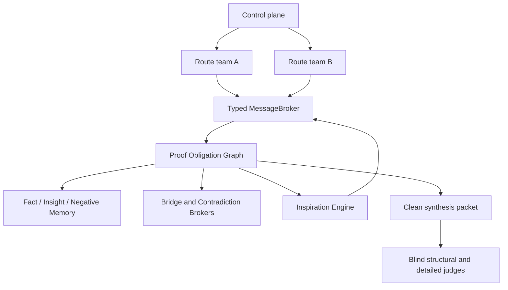

# Communication Topology

MathProofMesh 0.7 adds an opt-in `hierarchical_sparse` topology. The legacy
`SparseTopologyRouter` remains responsible for strategy diversity and agent
selection; typed communication replaces only free-form cross-route exchange.



## Four Planes

The control plane owns scheduling, budgets, failover, checkpointing and
Activity. It cannot create mathematical facts. The route-local plane owns one
route's strategy, verified checkpoint, deltas, skeptic feedback, typed inbox
and local memory. Routes never read another route's raw transcript.

The global proof blackboard contains only schema-validated facts, insights,
negative evidence, obligations, conflicts and route state. The final-audit
plane receives the problem, a cleaned proof and only the evidence explicitly
cited by that proof. It receives no author identity, route ranking, vote,
self-confidence, previous review or provider reasoning content.

## Isolation And Teams

For `initial_isolation_rounds`, every route works only from the problem and its
own state. Afterwards, a route may receive gated objects only from its bounded
neighbor set. A route team can assign a prover, conditional skeptic,
on-demand tool specialist and independent referee. If no distinct referee is
available, the artifact stays local and cannot enter `FactMemory`.

## Broker Routing

Every cross-route object passes through `MessageBroker.publish()`: schema and
problem hash checks, source ownership, size/scope validation, content hash,
deduplication, isolation, referee and evidence gates, target matching, per-route
and global rate limits, memory/graph persistence, Activity and receipt state.
Delivery keys are hashes of `(message_id, target_route_id)`.

Verified facts, exact counterexamples, selected open obligations and failure
records may cross routes when enabled. Unverified insights stay local by
default. Sparse routing uses relevance plus at most
`cross_route.max_neighbors_per_route`; it never performs an all-to-all
broadcast.

In active continuation mode, `broker.inbox(route_id)` is read immediately
before the Route Prover call. The sanitized prompt contains only admitted
messages plus route-scoped Fact, Insight, NegativeMemory and open-obligation
packets. The returned `MessageReceipt` objects are checked against hashes
recomputed by the Broker; a missing or mismatched required receipt prevents
that continuation call from advancing its checkpoint.

## Active Route Pipeline

An active route is not labeled as a team after the old proof flow has already
finished. Its candidate delta is executed through the route-team pipeline:

```text
Route Prover -> required Skeptic -> optional computation audit -> Referee
```

The Skeptic is mandatory for key steps, computation-backed artifacts and
anything approaching the global Fact gate. The Referee receives a sanitized
artifact rather than raw route transcripts. If any required role is missing,
fails, or returns an unrecognized result, the candidate remains route-local.

## Bridge And Conflict

`BridgeBroker` creates a bounded shared-lemma task when multiple routes expose
equivalent open obligations. It sends the task only to relevant routes and
closes nodes only with independently verified evidence. `ContradictionBroker`
normalizes scope before comparing claims. An exact replayed counterexample
overrides voting, enters negative memory and invalidates dependents. An
unresolved high-centrality conflict blocks the affected facts from synthesis.

## Shadow And Active

`proof_graph.mode: shadow` records graph signals and candidate actions without
changing legacy scheduling. `active` lets those signals create bridge,
conflict, merge and inspiration actions. `inspiration.mode` independently uses
the same `off | shadow | active` contract. Before synthesis, the graph is
frozen when configured, preventing late evidence mutation.

## Persistence

Checkpoints contain route registry, message broker and receipts, typed memory,
proof graph, bridge/contradiction state, inspiration state and capability
profiles. Route-team reviews are checkpointed as well. A delivered but
unacknowledged message restores with its consumed-prompt marker and is not
inserted into a prompt again; its pending receipt remains auditable. Stable
reports are written under
`reports/communication_topology.*`, `proof_graph.*`,
`message_diagnostics.md` and `hierarchical_metrics.json`.
