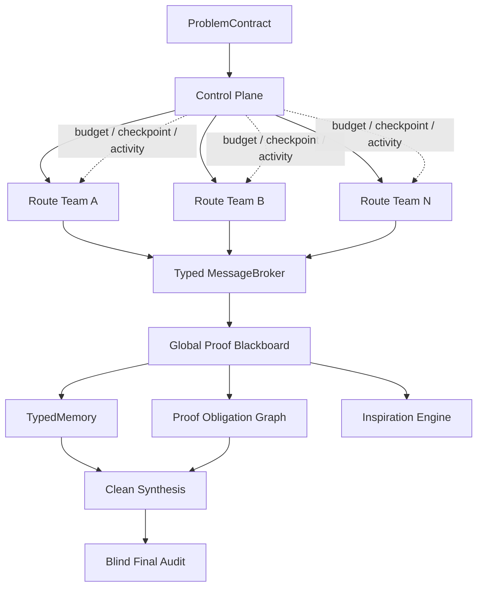
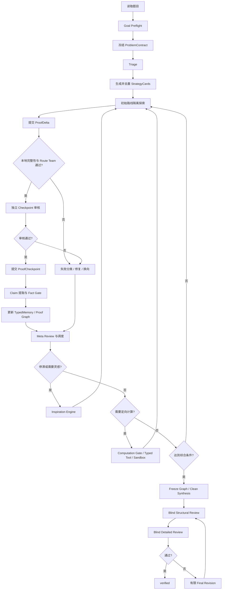

# MathProofMesh 0.7.0 综合介绍与使用指南

> **历史文档。** 本页冻结记录 v0.7.0 分层稀疏拓扑基线，不代表当前 v0.8.2 证明控制实现。当前版本、配置和验收结果以仓库根目录 `README.md`、`BUILD_INFO.json` 及 v0.8 实施映射文档为准。

本文是 MathProofMesh 0.7.0 的总入口文档，综合说明系统定位、运行架构、通信拓扑、证明状态、灵感机制、计算策略、验证边界、恢复机制、配置档位、部署方式和文档导航。它用于回答三个核心问题：

1. MathProofMesh 解决什么问题，以及它不保证什么；
2. 一道题从输入到最终报告，数据和控制如何流动；
3. 用户应当如何选择配置、启动运行、理解结果并排查故障。

本文描述的是 `feature/mathproofmesh-v0.7.0-hierarchical-sparse-topology` 分支上的 0.7.0 实现。表格和测试数字均是该历史基线的快照；当前运行参数以当前分支的 YAML 配置为最终依据。

## 1. 系统定位

MathProofMesh 是一个面向高难度数学证明、逻辑推理和研究型问题的多 Agent 证明编排系统。它不是让多个模型自由聊天，也不是把单个模型的思考长度简单放大。它将一次长程求解拆成可审计的策略生成、隔离探索、局部验证、跨路线通信、灵感触发、计算实验、证明综合和盲审终验。

0.7.0 的四项基本原则是：

- **隔离探索**：初始路线彼此隔离，避免一个早期错误假设污染全部方向；
- **抽象推理优先**：Python 和枚举用于定向验证，不作为默认路线生成器；
- **独立验证**：模型提出的 Claim、灵感和计算结果不能因自信度高而成为全局事实；
- **可恢复执行**：只从已外部化、已验证的数学状态恢复，不伪装恢复供应商私有思维链。

系统尤其适合以下场景：

- 一道题可能存在数论、组合、代数、几何等多个入口；
- 同一领域内需要并行探索多个子方向或局部换向；
- 一条路线需要跨多次模型调用逐段推进；
- 中间猜想需要精确计算、反例搜索或形式化微证书辅助；
- 运行时间长，需要断线接力、预算控制和全过程审计；
- 最终结论必须和未验证想法、路线投票及模型身份严格分离。

系统不承诺自动解出所有 IMO 难题，也不把 `verified` 等同于 Lean、Coq 或其他证明内核接受。这里的 `verified` 表示最终证明通过了当前配置要求的独立结构审查、详细审查和证据门控。

## 2. 0.7.0 相对旧版的核心升级

0.7.0 建立在 0.6.0 的 reasoning-first computation 和更早版本的 ProofCheckpoint 基础上，新增或强化了：

- 分层稀疏通信拓扑，不再依赖全连接辩论；
- Typed Message、MessageBroker、语义回执和 exactly-once 投递；
- Route Team 的 Prover、Skeptic、Tool Specialist、Referee 实际执行链；
- Fact、Insight、Negative 三层 TypedMemory；
- Proof Obligation Graph 和 proof debt；
- Bridge、Contradiction、重复路线检测；
- 完整 Inspiration Engine，而不是普通 widen 的别名；
- Persistent Meta-Strategist 的可执行 MetaDirective；
- 灵感候选群体、冷热上下文、Novelty Gate 和结果学习；
- Broker-admitted Fact 作为 hierarchical 模式唯一全局事实来源；
- 盲审证据净化、负面上下文限额和 artifact 路径脱敏；
- 旧 checkpoint 路线重建、恢复幂等和 Windows 原子写入增强；
- 深度调用档位、重复方向抑制、无正文失败恢复和瓶颈提取。

通用示例配置仍保留 `legacy_sparse` 兼容路径。DeepSeek 专用配置使用 `hierarchical_sparse`，其中 Proof Graph 和 Inspiration 可以分别运行在 `shadow` 或 `active` 模式。

## 3. 四平面总体架构

系统按职责分成四个平面：



### 3.1 Control Plane

控制平面负责：

- 调度轮、路线状态和动作准入；
- 模型调用、并发、token、费用和恢复预算；
- Agent 选择、故障切换和 provider circuit breaker；
- checkpoint、resume 和 Activity；
- 灵感任务、计算任务和验证升级的预算 admission。

控制平面不能直接创造数学事实。调度器选择一条路线继续，并不等于认可该路线正确。

### 3.2 Route-local Team

每条路线拥有独立的：

- StrategyCard；
- ProofCheckpoint 链；
- 当前 ProofDelta；
- Broker inbox；
- 路线作用域内的 Fact、Insight、Negative；
- 当前 obligation 和失败诊断。

普通路线团队遵守：

```text
Prover
  -> 条件触发 Skeptic
  -> 条件触发 Tool Specialist / Computation Auditor
  -> 独立 Route Referee
  -> Broker / Fact Gate
```

关键 Claim、计算型 Claim 和拟进入全局 Fact 的内容要求 Skeptic。作者、Skeptic 和 Referee 必须满足独立性约束；角色不足时应失败关闭或保持 route-local，不能降低门槛。

### 3.3 Global Proof Blackboard

全局证明黑板由三类结构组成：

- **TypedMemory**：已验证事实、未证灵感和负面证据；
- **Proof Obligation Graph**：目标、引理、构造、依赖和冲突；
- **Broker 状态**：消息、投递、回执、消费状态和稀疏邻接。

在 `hierarchical_sparse` 中，任何进入 verifier、synthesis、blind review 或 revision 的全局事实，都必须来自 Broker admitted TypedMemory facts。旧 `LemmaMemory` 不能绕过这条事实门。

### 3.4 Blind Final Audit

盲审平面只接收：

- 原题和冻结后的 ProblemContract；
- 清洗后的候选最终证明；
- 证明显式引用的 admitted evidence；
- 必须披露的精确反例和冲突。

它不接收：

- Agent ID 或 Route ID；
- 路线分数、投票、自信度和历史审稿结论；
- 原始思维链；
- 可能暴露作者身份的 artifact 路径。

这样可以避免“谁写的”“多少路线同意”替代数学审查。

## 4. 一道题的完整运行生命周期



### 4.1 Goal Preflight

系统先建立不可变 `ProblemContract`，其中包含原始题面、规范化题面、约束、允许工具、输出语言和完整性哈希。若预处理可能改变题意，系统应要求确认，而不是静默“修正”问题。

### 4.2 Triage 与策略生成

Triage 负责识别问题领域、主要风险、可用结构和潜在验证点，但不直接证明。Planner 随后生成多个 StrategyCard，并通过机制签名与相似度去重。

策略签名关注数学状态，而不是运行身份。它可以包含：

- 当前目标和 obligation；
- 表示方式；
- 核心机制；
- 辅助构造；
- 不变量；
- 关键变换；
- 假设和量词作用域。

Route ID、Agent ID、Attempt ID 和 Checkpoint ID 不构成“新方向”。

### 4.3 隔离探索与分段续推

初始路线在规定轮数内彼此隔离。Explorer 先做抽象推理，可以提交：

- 完整 ProofAttempt；
- 从父 checkpoint 出发的 ProofDelta；
- 精确的 `request_computation`；
- 放弃或报告瓶颈。

每个 ProofDelta 必须明确：

- 父 checkpoint；
- 新增结构化步骤；
- 当前目标；
- 剩余子目标；
- 未解决缺口；
- 新 Claim 和引用依赖。

只有通过完整性检查、Route Team 和独立 checkpoint 审核的 Delta 才能提交。后续探索从已提交 checkpoint 继续，而不是从未审计的长文本继续。

### 4.4 验证、Meta Review 与调度

结构验证先检查：

- 题目是否被偷换；
- Claim 是否完整；
- 依赖是否缺失；
- 量词和作用域是否一致；
- 关键步骤是否可审计。

详细验证再检查逻辑、代数、符号、边界、分类完备性、反例和首个错误步骤。Meta Reviewer 汇总的是结构化状态，不是全部原始对话。

调度器随后在 `WIDEN / DEEPEN / VERIFY / SYNTHESIZE / REVISE / STOP` 等动作中选择，并根据失败类型、proof debt、路线新颖性、已验证进展和剩余预算决定下一步。

### 4.5 综合与最终审计

进入综合前，Proof Graph 会冻结为不可变证据边界。Synthesizer 只能使用 admitted Facts 和显式允许的局部证明材料。最终盲审失败时可以进行有限修订，但修订后的证明必须重新经过盲审，不能沿用旧 PASS。

## 5. 数学状态与信任层级

### 5.1 ProofDelta 与 ProofCheckpoint

`ProofDelta` 是候选增量，`ProofCheckpoint` 是已经提交的验证状态。二者不能混用：

```text
模型输出 Delta
  -> Schema 和父子关系检查
  -> Route Team 审查
  -> 独立 checkpoint 审核
  -> 通过后提交 Checkpoint
```

某次 96K 或 128K 推理尚未返回正文时，不会在模型私有推理过程中自动生成 checkpoint。检查点只来自已外部化且通过审查的结构化内容。

### 5.2 TypedMemory

| 层级 | 含义 | 可否作为全局证明事实 |
| --- | --- | --- |
| FactMemory | 独立验证、作用域明确、依赖闭合的可复用 Claim | 可以 |
| InsightMemory | 未证思路、有限计算、灵感候选、待验证桥梁 | 不可以 |
| NegativeMemory | 精确反例、已拒绝 Claim、失效条件、失败机制 | 作为约束和警告 |

Fact promotion 至少要求：

- 状态和置信门槛满足配置；
- 证据类型允许；
- Referee 与作者独立；
- 量词、变量绑定和作用域已规范化；
- 依赖存在、无环且已经 admitted；
- 没有被复现的反例。

随机采样未发现反例只能得到 `not_refuted`。有限范围通过只能支持声明范围内的 `bounded_evidence`。

### 5.3 Fact 失效与依赖传播

若精确反例被独立复现：

1. 对应 Fact 被降级或失效；
2. 依赖它的 Fact 重新评估；
3. 相关 obligation 重新打开；
4. 使用该 Fact 的路线、综合和最终证明被标记；
5. 反例进入 NegativeMemory 和 Blind mandatory context。

这比简单“多数 Agent 认为错误”更强，因为可复现反例可以覆盖模型投票。

## 6. Proof Obligation Graph

Proof Obligation Graph 将“还缺什么”显式建模。节点可以是：

- 主目标与子目标；
- 引理和分情况；
- 辅助构造；
- 计算任务；
- 形式化任务；
- 冲突或反例。

边可以是：

- `depends_on`
- `implies`
- `refutes`
- `equivalent_to`
- `strengthens`
- `weakens`
- `uses_construction`
- `closes`

### 6.1 Proof Debt

Proof debt 不是简单的未完成步骤数量。它综合考虑：

- open obligation 的优先级；
- 节点中心性；
- 依赖深度；
- 共享路线数；
- 重复失败；
- 冲突风险；
- 已关闭义务和 verified Fact 的增量。

调度器用 proof debt 判断：

- 哪个瓶颈值得深化；
- 哪些路线实际上在重复原地打转；
- 是否出现共享瓶颈；
- 是否应触发 Bridge 或 Inspiration；
- 是否已经具备综合条件。

### 6.2 Bridge 与冲突

BridgeBroker 可以识别相同或相邻 obligation，生成有界桥梁任务。Reverse Goal 不会仅凭词法相似就声称 `A implies B`，而是要求显式变量映射、作用域、适用条件和缺失前提。

ContradictionBroker 负责规范化冲突范围。若精确反例成功 replay，它可以让相关 Claim 失效，而不是把冲突降为普通分歧。

## 7. Typed Message 与稀疏通信

### 7.1 为什么不用全连接辩论

全连接多轮聊天会造成：

- token 成本随 Agent 数快速增长；
- 早期错误广泛传播；
- 相同思路被不同措辞重复；
- 最终无法判断某条信息是否真正被使用；
- 恢复时难以做到幂等。

0.7.0 使用稀疏拓扑，每条路线只接收经过 Broker 筛选的相关信息。

### 7.2 MessageEnvelope

一条 Typed Message 至少描述：

- `problem_hash`
- 来源 Agent、Route 和角色；
- 目标 Route 或作用域；
- 数学陈述；
- 假设、结论、量词和变量绑定；
- 依赖；
- EvidenceType 与 MemoryTier；
- 验证状态；
- 内容哈希和 artifact 引用。

Broker 负责校验来源归属、哈希、大小、作用域、证据资格、初始隔离、稀疏邻居、每轮限额、TTL 和重复消息。

### 7.3 回执与 exactly-once

目标路线不能只返回“收到”。`MessageReceipt` 必须重新解析：

- 假设；
- 结论；
- 量词；
- 变量绑定；
- 语义哈希。

Broker 再计算哈希，避免“形式确认但语义理解错误”。投递状态和 prompt consumption 分开持久化：

- delivery 表示消息已可送达；
- receipt 表示目标路线正确解析；
- prompt consumption 表示消息确实进入了一次目标 prompt；
- verified utility 表示后续已提交 Delta 真正引用了消息或关闭了声明的 obligation。

恢复后不会因重启重复发送或重复计费同一条消息。

## 8. Inspiration Engine

Inspiration Engine 是 0.7.0 的一等模块，不是随机增加路线，也不是给普通 Explorer 更多 tokens。它在搜索停滞、路线同质化或局部瓶颈长期未解时，主动改变表示、构造或高层策略。

### 8.1 触发条件

典型触发包括：

- 连续调度轮没有新增 verified Fact；
- proof debt 长期不下降；
- 多条路线卡在同一 obligation；
- 多次出现相同 first error；
- 全部路线失败；
- 路线机制高度重复；
- 成本持续上升但无进展；
- 最终修订失败；
- 用户手动触发。

灵感不是只在最开始运行一次。系统在每个自适应调度轮重新观察状态；某条路线推进到新的 verified checkpoint 后，又卡在一个困难小步时，也可以从这个局部检查点触发换向。

### 8.2 执行闭环

```text
Trigger
  -> 生成 InspirationTask 与成本估算
  -> Scheduler Admission 和预算预留
  -> 多 Agent 独立生成候选
  -> 候选去重
  -> Novelty Gate
  -> 独立 Inspiration Referee
  -> 快速 Skeptic / 定向反驳
  -> 拒绝，或保存为 Insight
  -> 附加现有路线、创建 obligation、创建新路线或执行 MetaDirective
  -> 新路线真实证明尝试
  -> 普通 Route Team、Broker、Fact Gate
```

灵感提案不能直接成为 Fact。即使提案非常新颖，也必须走普通证明和验证流程。

### 8.3 候选群体与冷热上下文

Active 配置默认每个 admitted task 最多生成 3 个候选：

- 尽量轮换不同的可用 proposer Agent；
- Agent 数来自配置中的 live pool，不写死为 5；
- 多个 proposer 可用时，每个 Agent 至多承担一个候选；
- 只有一个 Agent 可用时，最多生成 warm/cold 两个候选；
- 去重后最多审查 2 个；
- 每次触发最多物化 1 个。

Warm Context 提供：

- 当前目标和 open obligations；
- 最相关的少量 Broker Facts；
- 最相关的少量 NegativeMemory；
- 已尝试路线的机制签名。

Cold Context 只提供：

- 原题；
- 当前目标 obligation；
- 禁止重复的机制列表；
- 必要的进度指标。

Cold Context 不提供完整旧证明，减少已有路线对新提案的锚定。

### 8.4 九类主要灵感能力

#### Representation Switchboard

将问题切换为结构不同的表示，例如：

- 模运算或 p-adic valuation；
- 图、有限状态机或生成函数；
- 坐标、复数、反演或投影表示；
- 极值问题、对偶问题或概率模型。

它只提出转换和新 obligation，不因“换了一种语言”就视为证明。

#### Analogy Agent

从本地已验证经验库检索结构相似的问题，输出：

- 对应对象；
- 对应操作；
- 可迁移引理；
- 迁移条件；
- 迁移失败风险。

没有可靠记录时返回空，不伪造类比。Negative Analogy Library 记录表面相似但条件不兼容的失败迁移。

#### Auxiliary Construction Inventor

为当前缺口提出辅助对象，例如辅助点、辅助圆、序列、图、势函数、商结构或中间引理，并显式列出：

- 构造的前提；
- 需要证明的良定义性；
- 构造如何连接当前缺口；
- 快速失败检查。

#### Invariant / Monovariant Hypothesis Agent

提出不变量、半不变量或单调量，并要求证明：

- 初始值；
- 每一步保持或单调；
- 边界条件；
- 它与最终目标之间的严格联系。

有限样例保持不变只构成候选，不构成一般证明。

#### Reverse Goal Analyzer

维护两个 frontier：

- Forward Frontier：Broker-admitted Facts 能推出什么；
- Backward Frontier：为了得到目标，哪些条件足够。

当两个 frontier 之间只差一个明确条件时，生成真正的 Bridge Lemma，而不是泛泛地说“寻找一个充分条件”。

#### Persistent Meta-Strategist

Meta-Strategist 输出可审计的 `MetaDirective`，例如：

- `continue`
- `repair`
- `rewrite_plan`
- `switch_representation`
- `cooldown_route`
- `abandon_route`
- `merge_routes`
- `allocate_surprise_budget`

MetaDirective 不进入 FactMemory 或 InsightMemory。它先经过 auditor 和 scheduler admission，再由控制平面确定性执行。

#### Surprise Budget Explorer

它使用可复现种子的受控变异算子，而不是随机长推理：

- dualize、complement、quotient；
- lift、project、extremalize；
- reverse operation；
- local-to-global；
- relax-then-round；
- encode as graph、polynomial 或 state machine。

预算在任务 admission 时预留，覆盖 proposer、Referee、可选 Skeptic 和首次路线尝试；未使用部分会释放。

#### Inspiration Composer

组合指向同一或相邻 obligation 的互补提案，例如：

- 有限状态表示 + 鸽巢原理；
- 图论编码 + 双计数；
- p-adic valuation + 极小反例；
- 辅助圆 + 幂定理。

组合结果必须再次独立审查，不能借用两个来源提案的审查结论。

#### Novelty Signature 与 Inspiration Referee

Novelty Signature 使用规范化数学本体描述：

- Representation；
- Principle；
- Transformation；
- Object；
- 目标 obligation；
- 核心机制和关键构造。

这样既允许同一领域内不同子目标、不同机制、不同表示并行，也能阻止只改措辞或 Route ID 的重复探索。

### 8.5 结果学习与归因

每个灵感提案都有 `InspirationOutcome`，记录：

- proposer、review、route 调用和 tokens；
- 是否物化；
- verified Fact 增量；
- 固定 route/obligation/message credit scope；
- proof debt 变化；
- 关闭的 obligation；
- 是否被最终证明引用；
- 是否被反驳；
- 首次产生收益所需轮数。

机制选择使用仅覆盖可调度机制的 UCB 和最低探索率。该分数只用于调度，不是数学证据。

Verified Experience Distiller 只从 Broker-admitted、严格验证且被最终证明实际引用的经验中提炼正面记录。失败迁移进入负面经验库。可选跨运行学习写入项目本地 `.mathproofmesh/learning`，不保存 API key、原始 prompt、私有思维链或原始供应商输出。

## 9. Reasoning-first Computation

### 9.1 基本原则

计算层遵守：

- 抽象逻辑推理始终优先；
- 便宜、精确的定向反驳可以尽早执行；
- 广泛枚举和模式搜索必须在停滞后经 Meta 审批；
- 反例证据门槛低，正面计算结论的证明门槛高；
- `not_refuted` 不等于 `verified`；
- 实验不能直接推进 ProofCheckpoint 或进入 FactMemory；
- 强类型工具优先，模型生成 Python 是隔离的最后手段。

“禁止计算优先”不等于“禁止尽早反驳错误猜想”。如果一个精确的小检查能立即推翻错误前提，系统应尽早做，避免继续浪费深度推理预算。

### 9.2 计算状态机

```text
Planner 记录非执行 ComputationHint
  -> Explorer 先做抽象推理
  -> request_computation
  -> ExperimentSpec
  -> ComputationGate
       reject / defer / allow
  -> Typed Tool
  -> 若 Typed Tool 无法表达且配置允许，再进入 Docker Python Sandbox
  -> ExperimentResult
  -> 同一 Explorer 从同一父 checkpoint 解释结果
  -> Reviewer 独立复算关键证据
```

`ExperimentSpec` 必须说明：

- 精确 target claim；
- assumptions 和 domain；
- 产生该命题的数学依据；
- 为什么继续手算不合适；
- 结果为正或反时分别如何决策；
- 已考虑的非计算替代；
- 方法、参数、精度、case 上限和随机种子。

### 9.3 Gate 决策

**Reject**：

- 目标不明确；
- 没有决策用途；
- 没有数学依据，只想“枚举看看规律”；
- 请求超出范围；
- 方法未注册；
- 需要 sandbox 但未启用。

**Defer**：

- broad search 尚未满足停滞条件；
- 需要 Meta 审批；
- 软实验额度不足；
- 运行后没有预算让 Explorer 解释结果。

**Allow**：

- 已命中可信缓存；
- 命题、假设和定义域明确；
- 使用精确或确定性方法；
- 成本低且用于 falsification；
- 或 broad search 已满足停滞、预算和 Meta 条件。

### 9.4 强类型工具与证据上限

| 工具类别 | 典型用途 | 正面证据上限 |
| --- | --- | --- |
| symbolic / SymPy | 精确恒等式、化简、因式分解 | 仅限明确等价条件 |
| modular exhaustive | 完整剩余类检查 | 需证明有限归约覆盖原题 |
| bounded integer / Z3 | 有限域约束搜索 | 仅覆盖声明的有限域 |
| graph certificate | 图结构证书与独立 replay | 仅证明证书对应性质 |
| recurrence / Fraction | 精确递推与有界序列 | 仅覆盖计算区间 |
| exact geometry | 有理坐标、行列式、共线共圆 | 避免浮点外推 |
| numeric counterexample | 抽样或候选反例 | 可反驳，不能证明 |

对于显式序列值、最小值、有限枚举和周期样例，Route-critical finite calculation gate 要求服务端拥有的证据引用。模型自行声称“已经算过”不能通过。

### 9.5 规律发现与证明分离

计算发现的模式必须保存为 `CandidateConjecture`，包括：

- 观察范围；
- 有限证据；
- 候选公式；
- 尚缺的证明 obligation；
- 可能的反例范围。

它可以指导下一步证明，但不会因有限样本吻合进入 FactMemory。

## 10. Python Docker 沙箱

只有强类型工具无法表达请求时，系统才允许模型生成 Python。沙箱默认安全要求包括：

- 固定镜像 digest；
- `--network none`；
- 只读根文件系统；
- 非 root；
- drop capabilities 和 no-new-privileges；
- CPU、内存、PID、超时和输出长度限制；
- 只提供临时目录，不挂载工作区；
- 不传递环境变量和 API key；
- AST 禁止 `open`、`exec`、`eval`、`compile`、`subprocess`、`socket`、动态导入和私有属性访问；
- JSON 输入和结构化 JSON 输出；
- 固定随机种子；
- 保存程序、输入、输出、镜像和哈希以供审计。

模型生成 Python 的正面结果最高只能是 `bounded_evidence`。候选反例仍需由可信独立检查器 replay。

验证当前配置的沙箱：

```powershell
.\.venv\Scripts\python.exe .\scripts\verify_sandbox.py `
  --config .\config.deepseek-v4-pro.topology-active.yaml
```

输出 `status: ok` 说明 Docker 隔离探针通过，不表示任何无限数学命题已被证明。

## 11. 调度、深度档位与重复抑制

### 11.1 预算分区

默认软预算比例为：

| 用途 | 比例 |
| --- | ---: |
| breadth | 30% |
| depth | 35% |
| verification | 25% |
| synthesis | 10% |

这些是可借用的软分区。调度器仍会保护 synthesis、final audit 和 revision 储备，避免探索阶段耗尽全部调用。

### 11.2 失败分类

系统区分：

- **execution failure**：网络、Schema、供应商或工具故障；
- **plan failure**：当前推进计划不充分，但大方向可能仍有效；
- **strategy failure**：核心数学机制或前提已被否定。

execution failure 可做有限修复；plan failure 可重写局部计划；strategy failure 默认不再围绕同一错误机制反复深化，而是优先触发表示切换、辅助构造或逆向目标。

### 11.3 数学签名与允许的并行探索

以下情况可以被视为不同探索，并允许并行使用 96K 或 128K：

- 不同数学领域；
- 同一领域中的不同子目标；
- 同一小目标采用不同核心机制；
- 同一机制族但使用实质不同的表示、构造或不变量；
- 路线推进到新的 verified checkpoint 后继续；
- 从同一 checkpoint 针对困难局部步骤创建新的换向分支。

系统阻止的是数学状态不变、机制签名不变、只更换 Agent 或措辞的重复大调用。每个未变化签名默认允许一次正常尝试和一次有界修复，随后冻结。

### 11.4 64K、96K 和 128K

Active 配置使用：

| 档位 | Thinking | 用途 | 独立 Artifact Recovery |
| ---: | --- | --- | ---: |
| 64K | `high` | 相同签名无进展后的单次有界修复，或新颖性确认前的修复 | 8K |
| 96K | `max` | 普通初始路线和明确局部目标的常规深化 | 12K |
| 128K | `max` | 96K 已取得 verified progress，并经 Meta 和预算准入后的深化 | 16K |

不同数学签名的高档调用可以并行，不设置“全局只能有一个 96K/128K”的锁。

DeepSeek 的 `max_tokens` 同时覆盖 reasoning 和最终正文。系统不能可靠地给同一次调用强制保留独立答案空间。因此 Artifact Recovery 是另一笔预留的非思考调用，只在深度调用没有可解析正文时用于提取结构化瓶颈或可挽救 artifact。

### 11.5 无正文失败与安全恢复

流式安全阈值是：

- 首个数据块最多等待 90 秒；
- 连续 300 秒完全没有 SSE 数据才视为连接停滞；
- 所有档位统一保留 7200 秒紧急硬上限。

只要 SSE 继续输出 reasoning，系统不会因旧的 8/12/18/25 分钟“无正文时间上限”提前中止。若调用耗尽 token 且正文为空：

1. 本次调用明确失败；
2. 不把私有 reasoning 当成 checkpoint；
3. 不自动换另一个 key 重跑同一整档；
4. 从调用前最后一个 verified checkpoint 启动一次 PostFailureBottleneckExtractor；
5. 提取当前目标、最小瓶颈、依赖、已尝试机制和替代方向；
6. 将诊断作为 route-local 状态，触发 repair 或 Inspiration；
7. 诊断不能进入 FactMemory。

已消耗的 reasoning tokens 无法找回，但不会被错误当作数学进展，也不会驱动相同方向连续重复消耗。

## 12. Validation Escalation 与最终正确性门

验证按风险逐级升级：

1. deterministic schema、依赖和有限证据检查；
2. fresh blind same-model review；
3. adversarial blind review；
4. 可选 heterogeneous provider review；
5. exact tool 或 formal micro-certificate。

### 12.1 结构审查优先

结构审查负责判断候选是否值得进入昂贵详细审查。它主要看：

- 题意一致性；
- Claim 是否可判定；
- 假设、量词和符号是否完整；
- 依赖是否闭合；
- 是否存在关键跳步；
- 是否把有限实验外推为一般结论。

### 12.2 详细审查

详细 Reviewer 必须：

- 重述被审 Claim；
- 检查每个关键推理；
- 定位首个错误步骤；
- 检查代数、符号、等号条件和边界；
- 检查分情况是否穷尽；
- 尝试构造反例；
- 解释工具证据的数学意义。

### 12.3 盲审负面上下文

Blind packet 不会无上限加入全部 NegativeMemory。系统按相关性、中心性、证据强度和上下文预算选择，但以下内容是 mandatory：

- 被独立复现的精确反例；
- 直接冲突；
- 当前最终证明显式依赖的失效 Fact。

如果 mandatory evidence 无法装入上下文，系统不能给出最终 PASS。

### 12.4 形式化微证书

Formal micro-certification 是后端中立的局部升级。形式化后端不可用时保持 pending；编译器拒绝首先产生“形式化映射或脚本失败”的 obligation，不能自动推断自然语言命题为假。即使后端接受，也仍需检查自然语言命题到形式命题的映射。

## 13. Agent Capability Profile

能力画像按 `(agent_id, domain, role)` 保存，而不是给每个 Agent 一个全局分数。系统可分别评估某个 Agent 在：

- 数论 Prover；
- 几何 Skeptic；
- 组合 Referee；
- 工具解释；
- 首错定位；
- 反例复现；
- 灵感生成

等位置上的表现。

画像可由 proof mutation、工具一致性、first-error accuracy、审稿 overturn 和已验证贡献更新。它只影响派工和验证升级，不能绕过证据门或独立性要求。

Agent 数量来自 YAML 中的启用列表。DeepSeek 示例附带 5 个角色配置，但代码不把 API key 数量写死为 5，增加 Agent 后 proposer pool、并发和角色选择会按配置扩展。

## 14. Checkpoint、断线接力与进程恢复

### 14.1 恢复的是什么

系统恢复：

- ProblemContract；
- StrategyCard 和 RouteRegistry；
- committed ProofCheckpoint；
- Proof Graph；
- TypedMemory；
- Broker 消息、delivery、receipt 和 prompt-consumption；
- Inspiration task、proposal、review、directive、outcome 和 reservation；
- 计算 spec、decision、program、result 和 evidence；
- 已用调用、token、费用和调度轮；
- provider circuit 状态。

系统不恢复：

- 供应商私有 KV cache；
- 未返回的内部 reasoning；
- 被截断 SSE 的隐藏后半段；
- 未经验证的临时猜想作为 Fact。

### 14.2 恢复优先级

```text
committed ProofCheckpoint
  > 已验证 stage state
  > 可审计 candidate Delta
  > partial SSE / private reasoning
```

最后一项不会作为数学状态恢复。

### 14.3 跨 key 接力

网络故障时，系统先执行同 key 的有限重试，再选择备用 Agent。接替者获得相同题目、相同已验证 checkpoint 和结构化失败信息，不会获得前一个 provider 的私有思维链。原作者仍被排除在对应独立 checkpoint 审核之外。

### 14.4 旧 checkpoint 迁移

0.6 checkpoint 恢复到 hierarchical 模式时，系统会：

- 重建 route registry；
- 重新注册 prover；
- 重建稀疏邻接；
- 隔离无法证明来源资格的 legacy claims；
- 在缺失 route、broker 或 typed memory 时失败关闭。

特别是 pre-strategy checkpoint，必须先重建路线再进入证明，不允许恢复成“有策略、无 Route”的半状态。

### 14.5 恢复命令

```powershell
.\.venv\Scripts\mathproofmesh.exe resume <run-id> `
  --config .\config.deepseek-v4-pro.topology-active.yaml
```

预算是累计值。若旧运行已经触及上限，需要在明确理解成本后提高配置上限，不能通过 resume 隐式清零。

## 15. Activity、运行产物与报告

### 15.1 Activity 显示什么

Activity 时间线显示：

- 当前阶段；
- Agent 任务；
- 结构化结果摘要；
- Broker publish、delivery、receipt；
- Proof Graph 和 TypedMemory 更新；
- Inspiration 触发、审查、物化和 directive；
- 计算 gate、执行和 replay；
- 心跳、排队、重试和失败类型。

它不显示原始 `reasoning_content`。终端中的“仍在处理、已收 chunks、约 tokens”只是 SSE 活跃度摘要，不是完整思维链。

模式：

| 模式 | 行为 |
| --- | --- |
| `compact` | 阶段和关键摘要 |
| `detailed` | 增加修复、心跳、消息和诊断事件 |
| `off` | 不实时显示，持久化仍由配置决定 |

### 15.2 运行目录

典型目录：

```text
runs/<run_id>/
  events/
  prompts/
  raw/
  structured/
  tools/
  deltas/
  checkpoints/
  experiments/
  reports/
```

关键报告通常包括：

- `reports/run_report.md`
- `reports/activity_timeline.md`
- `reports/activity_timeline.json`
- `reports/communication_topology.md`
- `reports/proof_graph.json`
- `reports/proof_graph.mmd`
- `reports/message_diagnostics.*`
- `reports/hierarchical_metrics.*`
- `reports/global_fact_inventory.*`
- `reports/final_experiment_audit.*`
- 深度探索和失败诊断报告。

CLI 终端会显示 Answer 摘要和文件路径。完整证明应写入 run report，而不是只存在终端。PowerShell 中可这样打开：

```powershell
Invoke-Item ".\runs\<run-id>\reports\run_report.md"
```

`raw/` 可能含供应商原始响应，属于敏感运行产物，不应提交到 Git。

## 16. 当前三种 DeepSeek 配置

### 16.1 配置对比

| 项目 | 冒烟版 | 正式版 | Active 拓扑正式版 |
| --- | ---: | ---: | ---: |
| 文件 | `config.deepseek-v4-pro.smoke.yaml` | `config.deepseek-v4-pro.yaml` | `config.deepseek-v4-pro.topology-active.yaml` |
| Agent 数 | 5 | 5 | 5 |
| 初始 / 最大路线 | 2 / 3 | 3 / 6 | 6 / 12 |
| 策略候选 | 3 | 6 | 12 |
| 最大调度轮 | 3 | 4 | 24 |
| 最大模型调用 | 40 | 60 | 450 |
| 总 token 硬预算 | 500,000 | 2,000,000 | 30,000,000 |
| 路线输出上限 | 96,000 | 100,000 | 128,000 |
| Planner strategy generation | 128,000 + max | 384,000 + max | 384,000 + max |
| 每动作连续证明段 | 2 | 2 | 2 |
| 每段最多新增步骤 | 8 | 12 | 20 |
| 每路线最多分段 | 4 | 12 | 20 |
| `max_context_chars` | 70,000 | 180,000 | 180,000 |
| Proof Graph | shadow | shadow | active |
| Inspiration | active | shadow | active |
| Docker Python Sandbox | enabled | enabled | enabled |
| 最大并行调用 | 5 | 5 | 5 |

注意：

- `provider_max_output_tokens: 384000` 是供应商能力边界，不表示每个 Agent 每次都会使用 384K；
- Planner 是单独例外，因为初始策略影响整个搜索空间；
- 冒烟版仍可能很慢，它是低总预算的真实流程测试，不是毫秒级单元测试；
- Active 正式版的 30M tokens 和 450 calls 是硬上限，不是运行目标；
- `max_context_chars` 限制传给模型的可见上下文字符，不是输出 token 数。

### 16.2 如何选择

使用冒烟版：

- 检查 key、SSE、Schema、Broker、灵感和沙箱是否连通；
- 快速观察流程是否能完成；
- 不适合据此评价高难 IMO 求解上限。

使用正式版：

- 希望保守启用分层拓扑；
- Proof Graph 和 Inspiration 先以 shadow 方式记录，不让它们主动改动主流程；
- 适合迁移验证和中等规模正式运行。

使用 Active 拓扑正式版：

- 需要完整灵感机制、Proof Graph 和 MetaDirective 真正参与调度；
- 题目足够困难，愿意承担长时间和高预算；
- Docker 已安装，且用户准备审查长程运行报告。

## 17. 安装、配置与运行

### 17.1 Windows 环境

首次创建环境：

```powershell
Set-Location "C:\path\to\MathProofMesh-0.6.0"
python -m venv .venv
Set-ExecutionPolicy -Scope Process Bypass
.\.venv\Scripts\Activate.ps1
python -m pip install -e ".[dev,server,desktop]"
```

已有 `.venv` 时只需：

```powershell
Set-Location "C:\path\to\MathProofMesh-0.6.0"
Set-ExecutionPolicy -Scope Process Bypass
.\.venv\Scripts\Activate.ps1
```

如果当前目录不是项目根目录，直接运行 `.\.venv\Scripts\...` 会报找不到命令；应先进入包含 `pyproject.toml` 和 `.venv` 的项目目录。

### 17.2 API key

示例配置使用：

```powershell
$env:DEEPSEEK_AGENT_1_KEY = "..."
$env:DEEPSEEK_AGENT_2_KEY = "..."
$env:DEEPSEEK_AGENT_3_KEY = "..."
$env:DEEPSEEK_AGENT_4_KEY = "..."
$env:DEEPSEEK_AGENT_5_KEY = "..."
```

这些变量只在当前 PowerShell 进程有效。不要把 key 写入 YAML、源码、README、截图、Issue、run report 或 Git 历史。

若以后增加 Agent，在 YAML 中增加 Agent 和对应 `api_key_env` 即可。灵感 proposer pool 和 Agent 选择逻辑根据启用配置动态扩展。

### 17.3 连通性探针

```powershell
.\.venv\Scripts\mathproofmesh.exe probe `
  --config .\config.deepseek-v4-pro.yaml

.\.venv\Scripts\mathproofmesh.exe probe `
  --config .\config.deepseek-v4-pro.yaml `
  --completion
```

`probe` 检查配置和连接；`--completion` 额外检查一次完整响应能力，会产生真实 API 用量。

### 17.4 运行用户题目

把题目写入 `my_problem.txt`，然后执行。

冒烟版：

```powershell
.\.venv\Scripts\mathproofmesh.exe solve .\my_problem.txt `
  --config .\config.deepseek-v4-pro.smoke.yaml `
  --run-id "smoke-$(Get-Date -Format yyyyMMdd-HHmmss)"
```

正式版：

```powershell
.\.venv\Scripts\mathproofmesh.exe solve .\my_problem.txt `
  --config .\config.deepseek-v4-pro.yaml `
  --run-id "formal-$(Get-Date -Format yyyyMMdd-HHmmss)"
```

Active 拓扑正式版：

```powershell
.\.venv\Scripts\mathproofmesh.exe solve .\my_problem.txt `
  --config .\config.deepseek-v4-pro.topology-active.yaml `
  --run-id "active-$(Get-Date -Format yyyyMMdd-HHmmss)"
```

PowerShell 的反引号必须是该行最后一个字符。不要把两条完整命令粘在同一行，否则会出现引用运算符或属性名称解析错误。

### 17.5 无 key 离线演示

```powershell
.\.venv\Scripts\mathproofmesh.exe demo `
  --continuation `
  --run-root .\demo-runs
```

它用于检查本地状态机和报告，不代表真实模型能力。

## 18. Desktop、HTTP 与部署

### 18.1 Desktop

Desktop 版基于本地服务和 WebView2。开发环境安装 `desktop` extra 后可运行：

```powershell
.\.venv\Scripts\mathproofmesh-desktop.exe
```

本地应用只绑定 loopback。记住的 API key 使用 Windows DPAPI 保存到用户本地数据目录，不写入项目仓库。

### 18.2 HTTP 服务

先设置服务 token：

```powershell
$env:MATHPROOFMESH_SERVER_TOKEN = "replace-with-a-long-random-token"
```

再启动：

```powershell
.\.venv\Scripts\mathproofmesh.exe serve `
  --config .\config.deepseek-v4-pro.yaml `
  --host 127.0.0.1 `
  --port 8000
```

不要在没有访问控制、反向代理和 TLS 的情况下把服务直接暴露到公网。

### 18.3 扩展点

可以扩展：

- 新 provider；
- 新 Agent 角色；
- 新 typed computation handler；
- 新 proof verifier；
- 新 Inspiration domain operator；
- 新 formal micro-cert backend；
- 新 Activity 前端。

扩展必须保持 Schema、证据等级、独立性、恢复和审计契约，不能只把一个普通函数接到 prompt 后就视为受信工具。

## 19. 可复现验证

本地完整验证：

```powershell
python -m pytest -q
python -m ruff check .
python -m ruff format --check .
python -m compileall -q src tests benchmarks
python -m benchmarks.topology.run_mock_benchmark
python .\scripts\directed_computation_smoke.py
```

当前记录的源码基线为：

- `360 passed`；
- Ruff check 通过；
- Ruff format check 通过；
- `compileall` 通过；
- topology Mock benchmark 通过且真实 provider 调用为 0；
- directed computation smoke 通过；
- GitHub CI 安装 `.[dev,server,desktop]` 后执行同类验证。

Mock benchmark 验证组件契约、状态机和消融开关，不证明真实 IMO 求解率提高。真实 provider 的准确率、成本和长期稳定性需要独立 benchmark，不能用固定公式模拟结果替代。

## 20. 安全与正确性边界

### 20.1 可以依赖的保证

- 未验证 Claim 不能因模型自信或路线多数进入全局 Fact；
- hierarchical 全局事实只能来自 Broker-admitted TypedMemory facts；
- 精确反例 replay 可以强制相关 Claim 失效；
- checkpoint 只保存外部化、结构化和已验证状态；
- blind review 不依赖 Agent 身份和路线投票；
- Python sandbox 不获得网络、工作区或 API key；
- resume 不重复已完成的 Broker 投递、灵感物化和实验；
- 预算、调用和 token 使用会累计持久化。

### 20.2 不能误解的事项

- `verified` 不是形式化证明内核的绝对保证；
- 高 confidence 不是证据；
- `not_refuted` 不是证明；
- bounded evidence 不能自动外推到无限命题；
- Planner 规划得详细不代表路线正确；
- Inspiration 提案新颖不代表可行；
- 128K reasoning 消耗大不代表取得了更多数学进展；
- Activity 心跳不等于完整思维链被保存；
- 多 API key 提高并发和角色独立性，不自动提高数学正确率。

## 21. 从 0.6 迁移到 0.7

推荐顺序：

1. 保留旧 run 和旧配置备份；
2. 安装新依赖并运行完整离线测试；
3. 先使用 `legacy_sparse` 或 shadow 模式验证兼容性；
4. 检查旧 checkpoint 能否重建 routes、Broker 和 TypedMemory；
5. 再启用 active Proof Graph；
6. 最后启用 active Inspiration；
7. 用低成本题验证报告、resume、exactly-once 和沙箱；
8. 再运行高预算题。

回滚时应切换到旧分支和旧配置，不要让新旧进程同时写同一个 run directory。

## 22. 文档地图

| 文档 | 主要内容 | 推荐读者 |
| --- | --- | --- |
| [ARCHITECTURE.md](ARCHITECTURE.md) | 状态机、组件、调度和故障模型 | 开发者、架构审查 |
| [COMMUNICATION_TOPOLOGY.md](COMMUNICATION_TOPOLOGY.md) | 四平面、Broker、Route Team、Bridge/Conflict | 多 Agent 与通信开发 |
| [TYPED_MESSAGE_PROTOCOL.md](TYPED_MESSAGE_PROTOCOL.md) | MessageEnvelope、scope、hash、receipt、exactly-once | Broker 和协议开发 |
| [TYPED_MEMORY.md](TYPED_MEMORY.md) | Fact、Insight、Negative、晋级和失效 | 正确性与证据开发 |
| [PROOF_OBLIGATION_GRAPH.md](PROOF_OBLIGATION_GRAPH.md) | obligation、依赖、proof debt、freeze | 调度与证明图开发 |
| [INSPIRATION_ENGINE.md](INSPIRATION_ENGINE.md) | 触发、九类机制、候选群体、结果学习 | 灵感机制开发 |
| [COMPUTATION_POLICY.md](COMPUTATION_POLICY.md) | reasoning-first、ExperimentSpec、Gate、工具和沙箱 | 计算工具与安全审查 |
| [VALIDATION_ESCALATION.md](VALIDATION_ESCALATION.md) | 风险升级、形式化微证书、mutation | 验证器开发 |
| [AGENT_CAPABILITY_PROFILE.md](AGENT_CAPABILITY_PROFILE.md) | Agent x Domain x Role 能力画像 | Agent 调度开发 |
| [PROMPT_PROTOCOL.md](PROMPT_PROTOCOL.md) | P0-P11 Prompt 输入输出和传输边界 | Prompt 与 Schema 开发 |
| [CHECKPOINT_RESUME.md](CHECKPOINT_RESUME.md) | 断线接力、恢复优先级、HTTP 恢复 | 长程运行与运维 |
| [ACTIVITY_TIMELINE.md](ACTIVITY_TIMELINE.md) | CLI 时间线、SSE 区别和前端接入 | 用户与前端开发 |
| [DEEPSEEK_V4_PRO.md](DEEPSEEK_V4_PRO.md) | DeepSeek Agent、key、SSE、探针和配置 | DeepSeek 用户 |
| [DEPLOYMENT.md](DEPLOYMENT.md) | provider 联调、成本、并发、HTTP 和扩展 | 部署与集成 |
| [MIGRATION_0.7.md](MIGRATION_0.7.md) | 0.6 到 0.7 的 rollout、checkpoint 和回滚 | 升级用户 |
| [VALIDATION.md](VALIDATION.md) | 可复现测试和回归记录 | 验收与 CI |
| [V0_7_BASELINE_AUDIT.md](V0_7_BASELINE_AUDIT.md) | 基线身份、模块映射和迁移风险 | 审计人员 |
| [RESEARCH_NOTES.md](RESEARCH_NOTES.md) | 多 Agent 证明研究背景与设计取舍 | 研究者 |
| [RELEASE_NOTES_0.7.0.md](../RELEASE_NOTES_0.7.0.md) | 0.7.0 变更历史与修复闭环 | 所有升级用户 |

## 23. 推荐阅读路径

### 普通使用者

1. 本文第 1、16、17、20 节；
2. [DEEPSEEK_V4_PRO.md](DEEPSEEK_V4_PRO.md)；
3. [ACTIVITY_TIMELINE.md](ACTIVITY_TIMELINE.md)；
4. [CHECKPOINT_RESUME.md](CHECKPOINT_RESUME.md)。

### 想理解灵感与多路线探索

1. 本文第 6、7、8、11 节；
2. [INSPIRATION_ENGINE.md](INSPIRATION_ENGINE.md)；
3. [PROOF_OBLIGATION_GRAPH.md](PROOF_OBLIGATION_GRAPH.md)；
4. [COMMUNICATION_TOPOLOGY.md](COMMUNICATION_TOPOLOGY.md)。

### 想使用 Python 和精确计算

1. 本文第 9、10 节；
2. [COMPUTATION_POLICY.md](COMPUTATION_POLICY.md)；
3. [VALIDATION_ESCALATION.md](VALIDATION_ESCALATION.md)。

### 想做代码审查或二次开发

1. [ARCHITECTURE.md](ARCHITECTURE.md)；
2. [TYPED_MESSAGE_PROTOCOL.md](TYPED_MESSAGE_PROTOCOL.md)；
3. [TYPED_MEMORY.md](TYPED_MEMORY.md)；
4. [PROMPT_PROTOCOL.md](PROMPT_PROTOCOL.md)；
5. [VALIDATION.md](VALIDATION.md)；
6. [V0_7_BASELINE_AUDIT.md](V0_7_BASELINE_AUDIT.md)。

## 24. 运行前后检查清单

运行前：

- 确认位于正确项目目录；
- 激活该项目自己的 `.venv`；
- key 只存在环境变量；
- `probe` 已通过；
- Docker Desktop 正在运行；
- `verify_sandbox.py` 已通过；
- 选择与目标和预算匹配的 YAML；
- `my_problem.txt` 题面完整且没有把提示混入命题；
- 磁盘空间足够保存长 run；
- run-id 唯一。

运行中：

- 观察 SSE 是否仍有数据，而不是只看墙钟时间；
- 区分 `ReasoningBudgetExhaustedError`、`StructuredOutputError` 和数学失败；
- 检查重复签名是否被冻结；
- 检查被 Referee 否定的路线是否仍被错误深化；
- 检查 Inspiration 是否由停滞或瓶颈触发，而不是无条件刷候选；
- 检查 broad computation 是否被 defer 到抽象路线停滞后。

运行后：

- 先读 `run_report.md`；
- 再读 activity、global fact inventory 和 proof graph；
- 对 `unverified` 区分“没有完整证明”和“已有明确反例”；
- 对 `verified` 检查最终证明实际引用了哪些 admitted evidence；
- 不把 `raw/`、`runs/`、API 输出或缓存提交到 Git；
- 需要继续时使用 `resume`，不要手工复制未验证文本到新 run 冒充 checkpoint。

## 25. 一句话总结

MathProofMesh 0.7.0 的核心不是“让五个模型想得更久”，而是把多方向探索、局部深化、灵感换向、定向计算、独立审稿和可恢复执行组织成一个有证据边界的证明系统：探索可以大胆，进入全局证明必须保守，失败可以继续，正确性门不能绕过。
